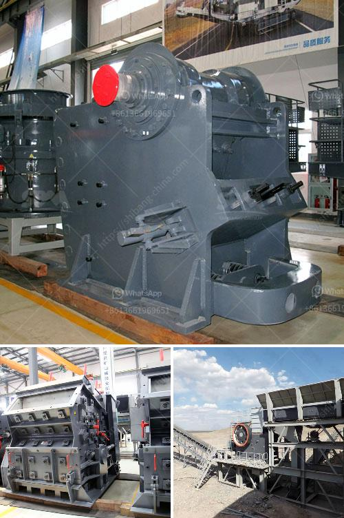

<h3>calculate crusher wear abrasion</h3>
Crusher wear abrasion is a significant threat to the operation and efficiency of any quarry or mining operation. It is essential to calculate crusher wear abrasion before it becomes a problem and impacts productivity. By accurately calculating the wear abrasion, operators can make informed decisions about when to replace or repair worn-out parts, reducing downtime and cost.

Calculating crusher wear abrasion begins with understanding the types of wear that can occur in a crushing environment. There are three main types of wear to consider:

1. Abrasive wear: This type of wear occurs when hard, sharp materials such as rocks or minerals grind against the crusher components. It is the most common form of wear and can cause significant damage over time.

2. Erosion wear: Erosion wear is caused by the continuous flow of material against the crusher components, gradually wearing them down. This type of wear is particularly common in high-impact and high-velocity applications.

3. Impact wear: Impact wear happens when large materials hit the crusher components with force. It can lead to dents, fractures, and other damage to the machine.

To calculate the crusher wear abrasion, several methods can be used. The most common approach is the Archard equation, which calculates the approximate wear in terms of volume loss per unit mass. The Archard equation states:

where W is the wear, k is the wear coefficient, F is the normal force, and H is the sliding distance.

To calculate the wear coefficient (k), operators can use empirical data or consult manufacturer specifications. For instance, different materials and crusher designs may have different wear coefficients.

The normal force (F) is the force exerted on the crusher components due to the material's weight or the external energy applied during operation. A simple way to estimate the normal force is to use the material's bulk density and the crusher's throughput.

The sliding distance (H) is the cumulative distance the material slides against the crusher components during a given period. It can be calculated by multiplying the material's velocity by the time in contact with the crusher components.

Once the wear, calculated using the Archard equation, exceeds a certain threshold that is specific to each crusher and wear part, it is time to consider replacement. Regular monitoring and recording of wear rates can help determine the optimal time for replacement or repair, minimizing downtime.

In addition to the Archard equation, several other methods, such as graphical approaches or numerical models, can also be used to calculate wear abrasion. These advanced methods consider factors such as surface roughness, material properties, and other parameters in more detail, leading to more accurate results. However, these methods may require sophisticated tools and expertise.

In conclusion, calculating crusher wear abrasion is essential for maintaining the efficiency and productivity of quarry and mining operations. Understanding the different types of wear and using appropriate equations can help estimate the wear on crusher components accurately. Regular monitoring and recording of wear rates are crucial for determining the optimal time for replacement or repair. By managing wear abrasion effectively, operators can minimize downtime and cost while maximizing productivity and profitability.
<h3>Contact us</h3><ul><li><strong>Whatsapp:&nbsp;<a href="https://wa.me/8613661969651">+8613661969651</a></strong></li><li><a href="https://swt.shibang-china.com/?git&amp;zhl&amp;calculate crusher wear abrasion"><strong>Online Service(chat now)</strong></a></li></ul><h3>Related</h3><ul><li><a href='high pressure grinding mill.md'>high pressure grinding mill</a></li><li><a href='movable stone crusher.md'>movable stone crusher</a></li><li><a href='used mobile coal screening plants.md'>used mobile coal screening plants</a></li><li><a href='smallfine powder grinding machine nigeria.md'>smallfine powder grinding machine nigeria</a></li><li><a href='screen vibrating screen for sand.md'>screen vibrating screen for sand</a></li></ul>