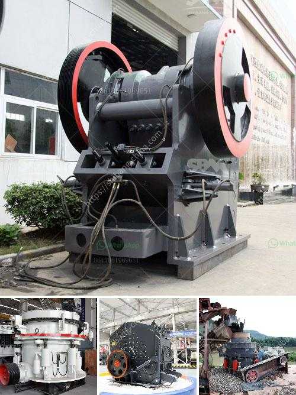

<h3>capacity 1 to 5 tons per hour price</h3>
When it comes to selecting equipment for industrial processes, finding the optimal balance between capacity and cost is a critical consideration. This is particularly relevant when evaluating machinery with capacities ranging from 1 to 5 tons per hour. Understanding the price range for these systems can assist with budgeting and making informed purchasing decisions.

Machinery with a capacity of 1 to 5 tons per hour can serve various industries, including mining, agriculture, or manufacturing. These systems offer the flexibility to handle moderate levels of production efficiently, making them a popular choice for medium-sized enterprises.

As for the price, it can vary depending on several factors. Key determinants include the complexity of the machine's design, the quality of materials used for construction, and the level of automation and control systems integrated. Additionally, the supply-demand dynamics and brand reputation may influence the price range.

Typically, prices for machinery with a 1 to 5-ton per hour capacity range from a few thousand dollars to tens of thousands of dollars. Budget-friendly options are available for simpler equipment with manual controls. These machines often require more human intervention and maintenance, but they are suitable for businesses on a tight budget.

However, for higher-performance models with advanced automation features, the price escalates. These machines offer greater efficiency, accuracy, and reliability, reducing the need for manual monitoring and oversight. Consequently, they ensure increased productivity while minimizing labor costs and potential human errors. Though more expensive upfront, these systems prove to be cost-effective in the long run.

When considering the price range, it is also important to factor in after-sales service and warranty offerings. Reliable technical support, readily available spare parts, and extended warranties might come with a slightly higher price tag but can save substantial costs and downtime in the future.

Purchasing machinery with a capacity of 1 to 5 tons per hour is a significant investment. It is crucial to conduct thorough research and compare prices from different manufacturers or suppliers. Evaluating the overall value, including machine features, reliability, and after-sales support, will help in finding the perfect price-to-performance ratio.

In conclusion, the price of machinery with 1 to 5 tons per hour capacity can range from affordable options for manual systems to higher-end models with advanced automation features. Understanding the factors influencing pricing, as well as considering long-term benefits and after-sales support, is essential for businesses to make an informed decision. By conducting diligent research and analysis, enterprises can strike a harmonious balance between capacity and cost for optimum operational efficiency.
<h3>Contact us</h3><ul><li><strong>Whatsapp:&nbsp;<a href="https://wa.me/8613661969651">+8613661969651</a></strong></li><li><a href="https://swt.shibang-china.com/?git&amp;zhl&amp;capacity 1 to 5 tons per hour price"><strong>Online Service(chat now)</strong></a></li></ul><h3>Related</h3><ul><li><a href='basalt curb stone crusher price.md'>basalt curb stone crusher price</a></li><li><a href='dolomite sand composition.md'>dolomite sand composition</a></li><li><a href='malaysia gravel crusher machine.md'>malaysia gravel crusher machine</a></li><li><a href='cement grinding units in india basalt crusher quotes.md'>cement grinding units in india basalt crusher quotes</a></li><li><a href='mobile quarry plant.md'>mobile quarry plant</a></li></ul>