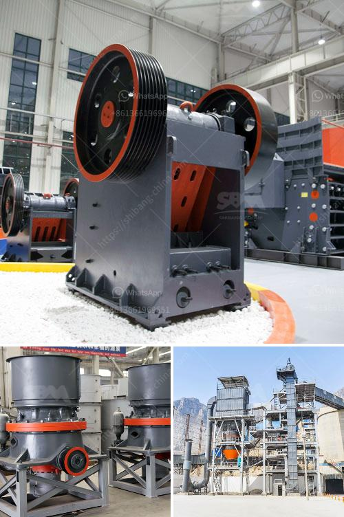

<h3>capacity stone crusher</h3>
The stone crusher is one such industry that exists in the vicinity of almost all major cities/towns throughout the country in all the states because the construction activities go on throughout the country. As transportation of stone over long distances adds to cost of the crushed stone products, the crushers need to be necessarily located nearer to the demand centers such as cities, bridges, canals etc. Stone crushers also need electricity supply and large number of man power for its operation. It also needs access roads for the movement of mined stone as well as crushed stone products. It is for these reasons that most stone crushers are located along the periphery of cities or in the vicinity of major construction projects.

In the present scenario, most of the crushers are not designed to operate beyond the capacity of 300-500 tonnes per hour. However, the availability of raw material and growing demand for crushed stones for construction makes the need for larger capacity stone crushers inevitable.

One of the key factors that propel the growth of the stone crushing equipment market is the growing demand for aggregates from construction industries. This has resulted in a surge in the production of crushed stone, thereby contributing to the growth of the market. Furthermore, technological advancements in the field of stone crushing equipment include the innovation of advanced crushing machines such as hydraulic cone crushers, mobile jaw crushers, impact crushers, and others. The stone crushing equipment market is gaining immense popularity due to the rising demand for aggregates globally.

High performance jaw crushers are ideally suited for use in construction and demolition waste crushing applications and are characterized by their capacity to process up to 300-500 tons of material per hour and their relatively low power consumption, resulting in significant cost savings. This type of stone crusher is widely used in construction industries and stone quarries to crush large stones into smaller pieces.

There are various models of stone crushers available in the market including hydraulically operated ones that provide high efficiency and low energy consumption. These machines are capable of crushing hard and soft rocks into a variety of sizes depending on the specific requirements of the end user.

Stone crushers are designed for high output and reliability, making them ideally suited for contractors and quarry operators looking to their capacity and output potential. As far as the maintenance goes, stone crushers require regular lubrication to ensure efficient operation and long life of the equipment. Regular maintenance also helps to prevent breakdowns, enhances reliability and extends the machine's lifespan.

Overall, the stone crusher industry has been witnessing a significant growth due to the increasing construction activities across the globe. The high capacity stone crushers are necessary in order to handle the ever-increasing construction demands. With the advancements in crushing technology, these machines have become more efficient, easier to operate, and provide higher output. To stay competitive in the market, stone crusher manufacturers are constantly investing in research and development to improve their products.
<h3>Contact us</h3><ul><li><strong>Whatsapp:&nbsp;<a href="https://wa.me/8613661969651">+8613661969651</a></strong></li><li><a href="https://swt.shibang-china.com/?git&amp;zhl&amp;capacity stone crusher"><strong>Online Service(chat now)</strong></a></li></ul><h3>Related</h3><ul><li><a href='second hand ball mill europe.md'>second hand ball mill europe</a></li><li><a href='iron ore pellet making process.md'>iron ore pellet making process</a></li><li><a href='how to make powder red clay for glazes.md'>how to make powder red clay for glazes</a></li><li><a href='gypsum board manufacturing machine price.md'>gypsum board manufacturing machine price</a></li><li><a href='business plan for stone quarry crusher pdf.md'>business plan for stone quarry crusher pdf</a></li></ul>