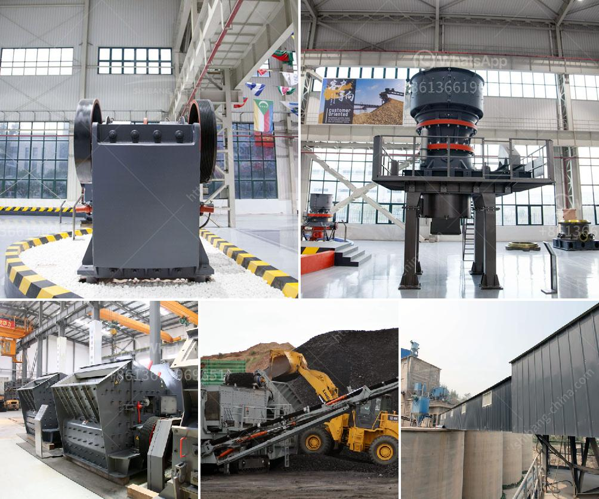

<h3>caterpillar stone crusher</h3>
Caterpillar stone crusher, also known as the rugged monster, is a powerful machine that transforms large rocks into sand and gravel quickly and effortlessly. Caterpillar stone crusher is a leading supplier of stone crusher machines worldwide; we offer a wide range of unique crushing machines that cater to the needs of various industries.

One of Caterpillar's most popular machines is the E-series range of stone crushers. These highly versatile machines can tackle almost any type of crushing job, from gravel pits to large-scale construction projects. The E-series features a powerful engine and robust design that ensures long-lasting performance even in the toughest conditions.

The engine of the Caterpillar stone crusher is a powerful, fuel-efficient one that meets the latest emission standards. With its low fuel consumption and high power output, it ensures that you can get the job done efficiently and cost-effectively. Whether you need to crush rocks for road construction or extract aggregates for concrete, the Caterpillar stone crusher is the perfect choice.

What sets Caterpillar stone crusher apart from its competitors is its durability and reliability. Built to withstand the harshest conditions, these machines are constructed using high-quality materials and components. Caterpillar stone crushers are engineered to last, providing you with years of trouble-free operation. Whether you need to crush rocks in extreme temperatures or deal with abrasive materials, Caterpillar stone crushers can handle it all.

In addition to their durability, Caterpillar stone crushers are also designed with operator comfort in mind. The cabs of these machines are spacious and ergonomically designed, ensuring that the operator can work comfortably for long hours. The intuitive controls make operating the machine a breeze, allowing even inexperienced operators to use it efficiently and safely.

Caterpillar stone crushers are highly versatile and can be customized to cater to specific crushing requirements. Whether you need to produce different sizes of aggregates or create specific types of sand, Caterpillar stone crushers can be adjusted to meet your needs. With a variety of screens and crushing chambers to choose from, you have full control over the final product.

Investing in a Caterpillar stone crusher is an investment in the future. These machines are known for their high resale value, meaning that you can easily sell them when you no longer need them. Additionally, Caterpillar stone crushers retain their efficiency and performance even after years of heavy use. This makes them a cost-effective solution that helps you get the most out of your investment.

In conclusion, Caterpillar stone crushers are the perfect solution for any crushing job. With their durability, reliability, and versatility, they can tackle even the most demanding projects. By investing in a Caterpillar stone crusher, you are investing in reliability, efficiency, and performance. So why settle for anything less? Choose Caterpillar and experience the power of the rugged monster!
<h3>Contact us</h3><ul><li><strong>Whatsapp:&nbsp;<a href="https://wa.me/8613661969651">+8613661969651</a></strong></li><li><a href="https://swt.shibang-china.com/?git&amp;zhl&amp;caterpillar stone crusher"><strong>Online Service(chat now)</strong></a></li></ul><h3>Related</h3><ul><li><a href='m sand crusher in district.md'>m sand crusher in district</a></li><li><a href='cement mobile laying block making machine.md'>cement mobile laying block making machine</a></li><li><a href='sell 150 tph stone crusher.md'>sell 150 tph stone crusher</a></li><li><a href='jaw crusher each equipment.md'>jaw crusher each equipment</a></li><li><a href='wet and dry ball mill.md'>wet and dry ball mill</a></li></ul>