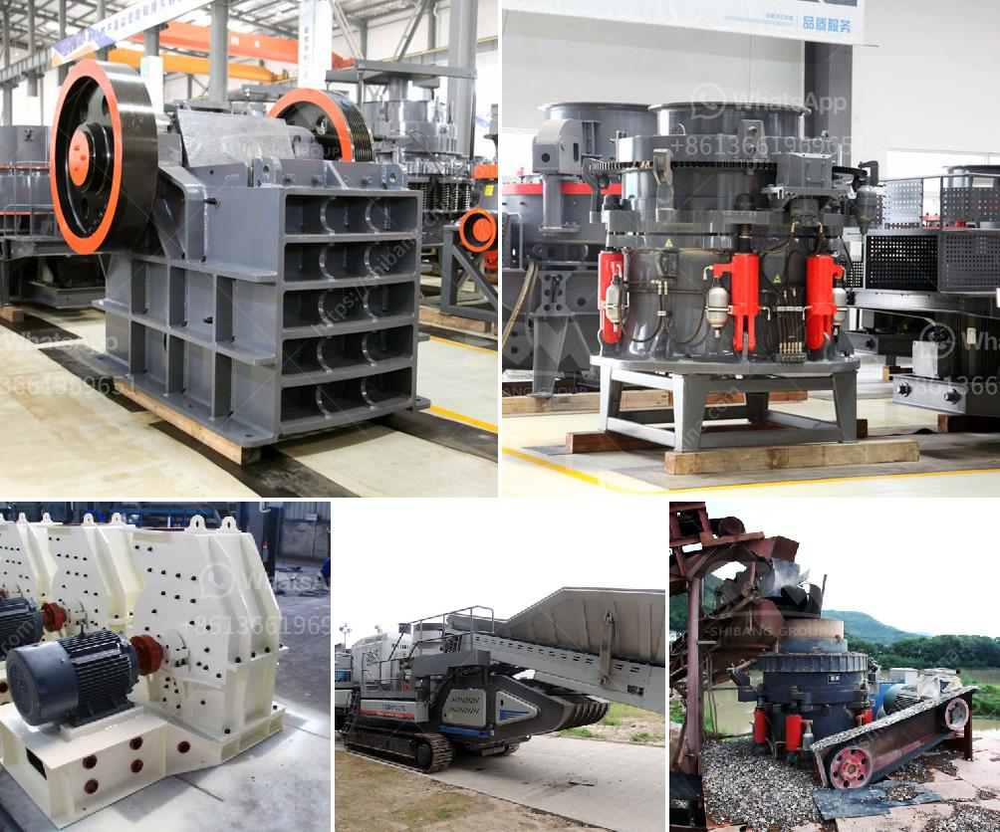

<h3>cebu supplier of disposable jaw crusher</h3>
Cebu Supplier of Disposable Jaw Crusher: Providing an Efficient Solution for Construction and Mining Industries

In the construction and mining industries, it is crucial to break down large stones, boulders, or rocks into smaller pieces that can be easily transported, processed, and used for various purposes. One essential piece of equipment that plays a significant role in accomplishing this task is the jaw crusher.

A jaw crusher is a machine that utilizes mechanical pressure to compress and break down materials such as stones, rocks, and ore into smaller pieces. It consists of a fixed jaw plate and a movable jaw plate, with the material being crushed between them. This equipment is commonly used in mining, metallurgy, building materials, highway, railway, water conservancy, and chemical industries, among others.

In Cebu, a bustling province in the Philippines known for its rich natural resources, there is a reliable supplier of disposable jaw crushers, if you are looking for a jaw crusher and its accessories or supplies, Cebu is the place to go. There are a few highly reliable suppliers of durable and reliable jaw crushers in Cebu that can provide you with everything you need for your construction and mining needs.

Cebu supplier of disposable jaw crusher understands the importance of quality and efficiency when it comes to construction and mining equipment. With a long history in the industry and a wide range of satisfied customers, they have earned a solid reputation for providing high-quality machinery that delivers outstanding performance. These suppliers offer a variety of models and sizes to meet the specific requirements of different projects.

The disposable jaw crusher supplied by these suppliers comes in reliable and sturdy designs that offer excellent crushing capabilities. These crushers have a long lifespan and are built to last, ensuring that they can withstand the rigorous demands of construction and mining activities. They are also easy to operate and maintain, allowing for increased productivity and reduced downtime.

Apart from the jaw crusher itself, these suppliers also provide all the necessary accessories and supplies that are crucial for the smooth operation of the equipment. This includes jaw plates, toggle plates, bearings, belts, and other components that may need to be replaced over time due to wear and tear. By having a reliable supplier who can provide these items promptly, you can minimize downtime and keep your operations running smoothly.

Whether you are involved in small-scale construction projects or large-scale mining operations, having a reliable supplier of disposable jaw crushers in Cebu can make a significant difference in your productivity and profitability. With their commitment to quality and customer satisfaction, these suppliers can provide you with the equipment and support you need to meet your project goals.

In conclusion, Cebu suppliers of disposable jaw crushers are an essential resource for the construction and mining industries. With their high-quality equipment and top-notch customer service, they can help you enhance the efficiency and productivity of your operations. Whether you are in need of a jaw crusher or any related accessories and supplies, reaching out to these reliable suppliers in Cebu is a wise choice.
<h3>Contact us</h3><ul><li><strong>Whatsapp:&nbsp;<a href="https://wa.me/8613661969651">+8613661969651</a></strong></li><li><a href="https://swt.shibang-china.com/?git&amp;zhl&amp;cebu supplier of disposable jaw crusher"><strong>Online Service(chat now)</strong></a></li></ul><h3>Related</h3><ul><li><a href='ore crusher copper ore crusher.md'>ore crusher copper ore crusher</a></li><li><a href='mobile quarry plant.md'>mobile quarry plant</a></li><li><a href='machine for gypsum factory from philippines.md'>machine for gypsum factory from philippines</a></li><li><a href='jaw crusher mem fr90.md'>jaw crusher mem fr90</a></li><li><a href='m sand crusher in district.md'>m sand crusher in district</a></li></ul>