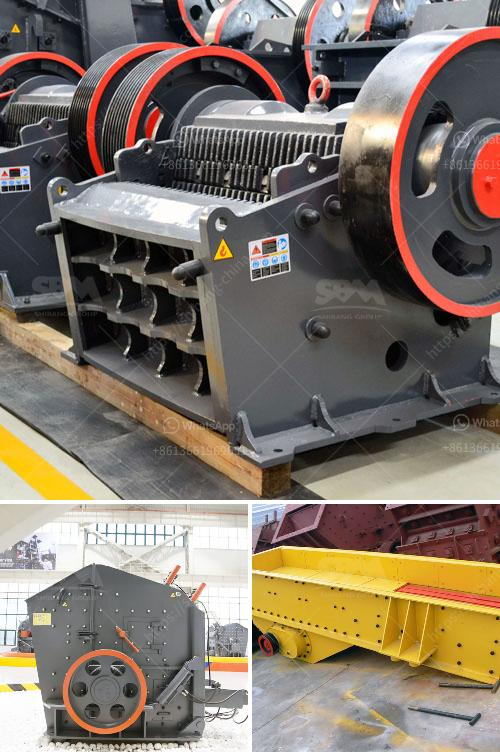

<h3>cec rock crushers for sale</h3>
Crushing and processing materials efficiently is the cornerstone of any successful construction or mining project. If you are looking for high-quality rock crushers for sale, CEC Equipment Sales has you covered. CEC, short for Construction Equipment Company, has been manufacturing top-notch rock crushing equipment for over 35 years. Their extensive range of crushers, screens, and other heavy-duty machinery is designed to handle even the toughest materials, ensuring optimal performance and productivity on your worksite.

One of the standout products offered by CEC Equipment Sales is their line of rock crushers. These crushers are specifically designed to break down and process various types of rocks, including granite, limestone, concrete, and more. Whether you are working on a small-scale residential project or a large commercial site, CEC rock crushers provide the necessary power and efficiency to get the job done.

One of the key features of CEC rock crushers is their versatility. With different models and sizes available, you can select the crusher that best suits your needs and job requirements. From small-scale crushers that are perfect for residential projects to larger crushers that can handle heavy-duty commercial applications, CEC offers a wide range of options.

Another advantage of CEC rock crushers is their ease of use. The user-friendly control panel and hydraulic system make operating these crushers a breeze. Additionally, CEC rock crushers are designed with user safety in mind, incorporating safety features such as emergency stops and protective guards. This ensures that your operators can work confidently and efficiently, minimizing the risk of accidents or injury.

When it comes to durability, CEC rock crushers are in a league of their own. Built with sturdy materials and using the latest technology, these crushers are designed to withstand the rigors of heavy-duty use. Whether you are crushing rocks daily or intermittently, you can count on CEC rock crushers to deliver consistent performance for years to come. This durability translates into long-term cost savings, as you won't have to worry about frequent repairs or replacements.

CEC Equipment Sales understands that every project is unique and requires specific equipment. To cater to this, they offer customization options for their rock crushers. Whether you need a specialized crusher size, additional screens, or other modifications, CEC can tailor their rock crushers to fit your exact requirements.

Furthermore, CEC Equipment Sales provides excellent after-sales support. Their team of knowledgeable professionals is always available to assist you with any technical questions, troubleshooting, or spare parts orders. With prompt customer service and reliable technical assistance, you can rest assured that CEC will be there to support you every step of the way.

In conclusion, if you are in the market for a reliable and efficient rock crusher, consider CEC Equipment Sales. With their extensive range of crushers, customization options, durability, and excellent after-sales support, CEC rock crushers are an excellent investment for any construction or mining project. Browse their selection of rock crushers today and see how CEC can help you improve productivity and efficiency on your worksite.
<h3>Contact us</h3><ul><li><strong>Whatsapp:&nbsp;<a href="https://wa.me/8613661969651">+8613661969651</a></strong></li><li><a href="https://swt.shibang-china.com/?git&amp;zhl&amp;cec rock crushers for sale"><strong>Online Service(chat now)</strong></a></li></ul><h3>Related</h3><ul><li><a href='method statement of installation conveyor belt.md'>method statement of installation conveyor belt</a></li><li><a href='discharge chute for ball mill.md'>discharge chute for ball mill</a></li><li><a href='cost of concrete batch plant.md'>cost of concrete batch plant</a></li><li><a href='crushing plant in pakistan.md'>crushing plant in pakistan</a></li><li><a href='concrete crushing equipment price.md'>concrete crushing equipment price</a></li></ul>