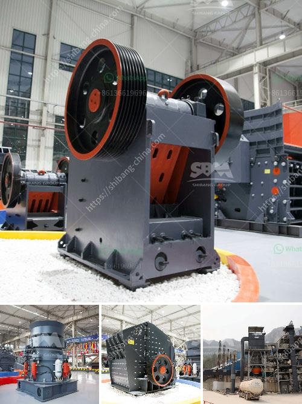

<h3>cement clinker price cement clinker price</h3>
Cement clinker is a crucial raw material used in the manufacturing of cement. As such, it plays a significant role in determining the overall cost of cement production. The price of cement clinker is subject to fluctuation due to various factors. This article explores the key factors influencing the cement clinker price and their impact on the construction industry.

One of the primary determinants of cement clinker price is the demand and supply dynamics. When the demand for cement is high, the price of cement clinker tends to rise. This is because cement manufacturers require more clinker to meet the increased production requirements. Conversely, when the demand for cement decreases, manufacturers adjust their clinker procurement, leading to a drop in prices.

Another crucial factor influencing the cement clinker price is the availability and cost of raw materials. Cement clinker is primarily made from limestone and clay, which need to be abundant and easily accessible. If there are any disruptions in the supply chain or limitations in obtaining raw materials, the price of cement clinker could rise significantly. Weather conditions, natural disasters, or political instability in regions where these raw materials are sourced can all impact their availability and cost.

Transportation costs also play a role in determining the cement clinker price. The distance between the clinker production and cement manufacturing plants can significantly influence the final cost. Long transportation distances and inefficient logistics can increase the price of cement clinker. Additionally, fluctuations in fuel prices, necessary for transportation, can further impact the overall cement clinker cost.

Energy costs are another essential factor affecting the cement clinker price. The production of clinker requires high temperatures that are typically achieved through the use of fossil fuels. Fluctuations in energy prices, such as oil or gas, directly impact the manufacturing cost of cement clinker. Higher energy costs result in increased production expenses, which are then passed on to consumers, leading to higher cement prices.

Furthermore, regulatory measures and taxes imposed by governments can also affect the cement clinker price. Environmental regulations, especially those related to emissions and carbon footprint reduction, can result in additional costs for cement manufacturers. Compliance with these regulations may require the implementation of new technologies or retrofitting of existing production facilities, consequently increasing the production cost of cement clinker.

Moreover, the global economic conditions and currency exchange rates can impact cement clinker prices. If the economy is experiencing a downturn, the construction industry may slow down, reducing the demand for cement. This can, in turn, lead to a drop in cement clinker prices. Likewise, currency fluctuations can affect the import and export costs of cement clinker, influencing its price in different markets.

In conclusion, the cement clinker price is affected by several factors, including demand and supply dynamics, availability and cost of raw materials, transportation costs, energy prices, regulatory measures, and global economic conditions. Understanding these factors can help stakeholders in the construction industry anticipate and react to changes in cement clinker prices. By closely monitoring these variables, manufacturers and consumers can make informed decisions regarding cement procurement and project budgeting in a volatile market.
<h3>Contact us</h3><ul><li><strong>Whatsapp:&nbsp;<a href="https://wa.me/8613661969651">+8613661969651</a></strong></li><li><a href="https://swt.shibang-china.com/?git&amp;zhl&amp;cement clinker price cement clinker price"><strong>Online Service(chat now)</strong></a></li></ul><h3>Related</h3><ul><li><a href='rotary kiln manufacturers in australia.md'>rotary kiln manufacturers in australia</a></li><li><a href='crushing plant in pakistan.md'>crushing plant in pakistan</a></li><li><a href='gold mining equipment for sale in south africa.md'>gold mining equipment for sale in south africa</a></li><li><a href='the gold mining process in zimbabwe.md'>the gold mining process in zimbabwe</a></li><li><a href='approach to the problem of a mineral crusher.md'>approach to the problem of a mineral crusher</a></li></ul>