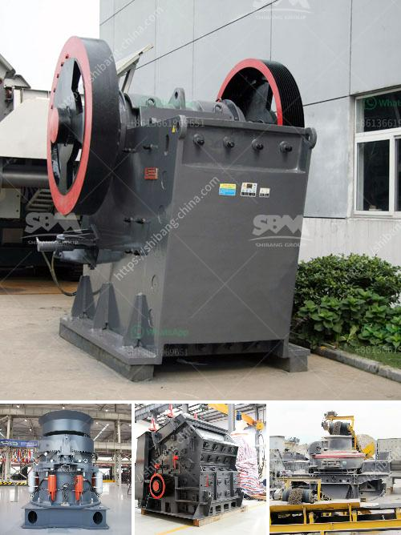

<h3>cement clinker processing equipment</h3>
Cement clinker is the essential component of Portland cement, which is the most commonly used type of cement in construction. The clinker is a nodular material produced by heating a mixture of limestone and clay to a high temperature, usually around 1450 degrees Celsius. This process, known as calcination, results in the formation of small, interlocking crystals of calcium silicate, commonly referred to as clinker.

Once the clinker has been produced, it needs to be finely ground in order to create cement. This is where cement clinker processing equipment comes into play. The processing of clinker involves crushing and grinding to produce a fine powder, known as cement. In addition to this, other processes such as blending and storing may also be required to ensure a consistent quality product is achieved.

There are several types of cement clinker processing equipment available in the market today. Traditionally, ball mills have been used for grinding the clinker. This method involves rotating a cylinder filled with steel balls at a high speed to break down the clinker into a fine powder. While ball mills are still widely used, new technologies such as vertical roller mills and high-pressure grinding rolls have also been introduced.

Vertical roller mills (VRMs) are becoming increasingly popular for grinding clinker. This equipment consists of a rotating table onto which the clinker is fed through an airstream. The clinker is then ground between a series of rollers and a rotating grinding table. The advantage of VRMs is their ability to produce a highly efficient and consistent grind. They also require less energy compared to ball mills.

Another alternative to traditional grinding methods is high-pressure grinding rolls (HPGRs). This equipment consists of two counter-rotating rolls that compress the clinker between them. The clinker is then crushed and ground as it passes through the gap between the rolls. HPGRs offer several advantages, including higher grinding efficiency, reduced energy consumption, and a smaller footprint.

In addition to grinding, cement clinker processing equipment may also include other processes such as blending and storage. Blending involves the mixing of different clinker sources to achieve the desired chemical composition. This can be done manually or with the help of automated systems. Storage, on the other hand, involves the safe and efficient handling of the clinker before it is transported for further processing or use.

Overall, the processing of cement clinker requires specialized equipment to ensure a consistent quality product is achieved. Technologies such as ball mills, vertical roller mills, and high-pressure grinding rolls play a vital role in the grinding process. Blending and storage are equally important processes that contribute to the overall efficiency and quality of cement production.

As the demand for cement continues to rise, it is crucial for manufacturers to invest in modern and efficient cement clinker processing equipment. This will not only ensure a steady supply of high-quality cement but also reduce energy consumption and environmental impact. By embracing these advanced technologies, the cement industry can meet the growing demands of the construction sector while contributing to a sustainable future.
<h3>Contact us</h3><ul><li><strong>Whatsapp:&nbsp;<a href="https://wa.me/8613661969651">+8613661969651</a></strong></li><li><a href="https://swt.shibang-china.com/?git&amp;zhl&amp;cement clinker processing equipment"><strong>Online Service(chat now)</strong></a></li></ul><h3>Related</h3><ul><li><a href='design of screening machines.md'>design of screening machines</a></li><li><a href='stone crusher malaysia.md'>stone crusher malaysia</a></li><li><a href='silicon wafer crusher.md'>silicon wafer crusher</a></li><li><a href='limestone crusher china.md'>limestone crusher china</a></li><li><a href='crusher machine bottlecrusher machine bottles.md'>crusher machine bottlecrusher machine bottles</a></li></ul>