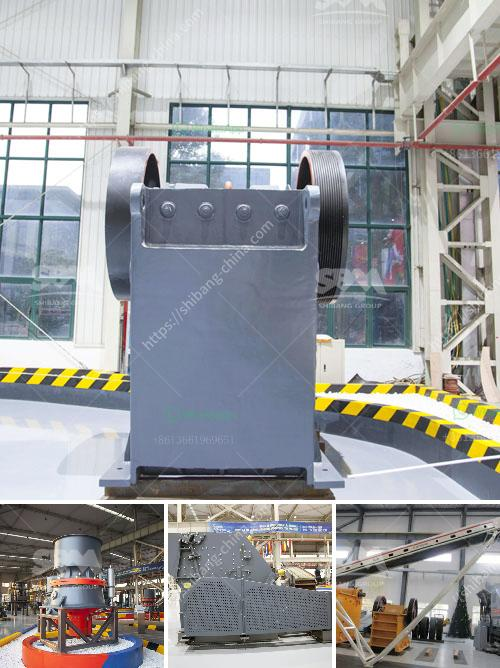

<h3>cement crusher in turkey</h3>
In recent years, Turkey has witnessed a significant boom in construction sector, primarily driven by the government's ambitious infrastructure development projects. With this surge in construction activities, the demand for cement has skyrocketed, bringing the need for efficient cement crushers in the forefront.

Cement is a widely used material in the construction industry. It is a binder, a substance that sets and hardens, and can bind other materials together. At its core, cement production requires a combination of raw materials, such as limestone, clay, and other minerals, that are crushed and ground into a fine powder. This powder, known as cement, acts as a key ingredient in concrete and mortar production.

Cement crushers play a crucial role in the cement production process, enabling the quick and efficient comminution of clinker, a critical component of cement. In Turkey, cement crushers are widely used in cement plants whose main raw material is clinker, a semi-finished product obtained through the calcination of limestone and clay.

1. Cost-efficient production: Cement crushers in Turkey offer cost-efficient crushing solutions. By crushing the clinker, various types of crushers reduce material size, ensuring easier and more efficient grinding process, ultimately resulting in cost savings for cement manufacturers.

2. Enhanced product quality: By employing cement crushers in the production process, Turkish cement manufacturers can ensure consistent and evenly ground clinker, leading to higher-quality cement samples. This, in turn, improves the overall strength and durability of concrete and mortar, making cement crushers an essential tool for construction projects.

3. Waste reduction and sustainability: Cement crushers help reduce waste generated during the production process. As clinker size is controlled through crushing, manufacturers can avoid oversize clinker, which would otherwise lead to unnecessary waste. By utilizing these crushers effectively, the cement industry in Turkey can contribute to sustainable development by minimizing waste and conserving resources.

4. Enhanced process efficiency: Cement crushers increase the efficiency of the overall cement production process. By crushing clinker to a precise size, these crushers allow for better control of the grinding process, resulting in optimal cement production and minimizing energy consumption.

Cement crushers in Turkey have become an indispensable tool for the construction industry, playing a vital role in clinker crushing and grinding. These crushers offer cost-efficient solutions, enhance product quality, reduce waste, and improve overall process efficiency for cement manufacturers.

With the continued growth of infrastructure and construction projects in Turkey, the cement industry is poised for further expansion. As a result, the demand for high-performance cement crushers will continue to rise, driven by the need for faster, more efficient, and sustainable cement production.

As innovative technologies continue to emerge, cement crushers can be expected to evolve, providing even more advanced crushing solutions for the cement industry in Turkey. These machines will continue to revolutionize cement production processes, enabling the country's construction sector to meet the challenges of today and embrace a sustainable future.
<h3>Contact us</h3><ul><li><strong>Whatsapp:&nbsp;<a href="https://wa.me/8613661969651">+8613661969651</a></strong></li><li><a href="https://swt.shibang-china.com/?git&amp;zhl&amp;cement crusher in turkey"><strong>Online Service(chat now)</strong></a></li></ul><h3>Related</h3><ul><li><a href='cost of copper ore processing plant.md'>cost of copper ore processing plant</a></li><li><a href='density of fine aggregate granite.md'>density of fine aggregate granite</a></li><li><a href='ball milling method in tamil.md'>ball milling method in tamil</a></li><li><a href='cement export price in ethiopia.md'>cement export price in ethiopia</a></li><li><a href='salt crusher plant process price.md'>salt crusher plant process price</a></li></ul>