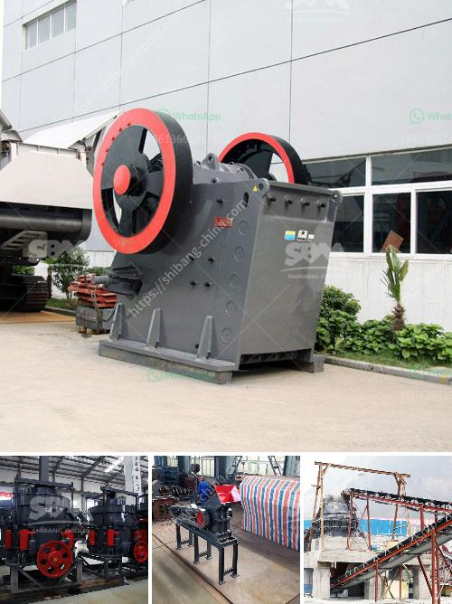

<h3>cement export price in ethiopia</h3>
Ethiopia has emerged as one of Africa's fastest-growing economies in recent years, experiencing significant development in industries such as construction. As a result, there has been a surge in demand for cement, both domestically and internationally. This demand has led to a rise in cement exports from Ethiopia and subsequently, a fluctuation in cement export prices. In this article, we will delve into the factors influencing cement export prices in Ethiopia and explore the implications for the local economy.

One of the major factors affecting cement export prices in Ethiopia is supply and demand dynamics. The construction sector in the country has been booming, fueled by government infrastructure projects and private sector investments. The demand for cement to support these activities has been substantial, leading to a shortage of supply. As a result, cement producers are able to command higher export prices due to the limited quantity available.

Another significant factor affecting cement export prices is production costs. Ethiopian cement producers face various challenges in terms of high production costs. These challenges include electricity shortages and frequent power outages, which result in increased operating costs. Additionally, the reliance on imported raw materials and machinery adds to the production costs. The higher production costs can lead to an increase in cement export prices as manufacturers aim to cover their expenses and maintain profitability.

The state of infrastructure in the country also plays a role in cement export prices. Ethiopia's transport and logistics infrastructure has been a bottleneck for export activities, including cement. Poor road networks, limited port capacity, and lengthy clearance procedures increase transportation costs and lead to delays in delivering cement to the export market. These inefficiencies can contribute to higher cement export prices as exporters factor in additional costs and potential revenue loss due to delays.

Currency fluctuations also have a direct impact on cement export prices. Ethiopia's currency, the Ethiopian birr, has experienced volatility in recent years. Fluctuations in the exchange rate can impact the cost of imported raw materials and machinery used in cement production. When the local currency weakens, it increases the cost of inputs, leading to higher production costs and ultimately higher export prices.

The implications of fluctuating cement export prices on the local economy are multifaceted. On one hand, higher cement export prices can generate increased revenue for cement manufacturers, which can be reinvested in expanding production capacities and improving infrastructure. This can lead to job creation and economic growth. On the other hand, it can also have adverse effects. Higher cement prices can hamper domestic infrastructure development and construction activities as local contractors face increased costs. This, in turn, can hinder economic growth and the competitiveness of Ethiopian companies in international markets.

In conclusion, the cement export price in Ethiopia is influenced by several factors, including supply and demand dynamics, production costs, infrastructure limitations, and currency fluctuations. While higher export prices can benefit cement producers in the short term, it is crucial to strike a balance to ensure sustained economic growth. The Ethiopian government could consider implementing policies that address infrastructure challenges and encourage local production of cement raw materials and machinery, thereby reducing production costs. Additionally, diversifying export markets and reducing reliance on a single export commodity can help mitigate risks associated with fluctuating export prices.
<h3>Contact us</h3><ul><li><strong>Whatsapp:&nbsp;<a href="https://wa.me/8613661969651">+8613661969651</a></strong></li><li><a href="https://swt.shibang-china.com/?git&amp;zhl&amp;cement export price in ethiopia"><strong>Online Service(chat now)</strong></a></li></ul><h3>Related</h3><ul><li><a href='nigeria jaw crusher.md'>nigeria jaw crusher</a></li><li><a href='coal screening machine suppliers.md'>coal screening machine suppliers</a></li><li><a href='raymond mill for sale second hand.md'>raymond mill for sale second hand</a></li><li><a href='mobile crusher capacity per hour.md'>mobile crusher capacity per hour</a></li><li><a href='ball mill hammer.md'>ball mill hammer</a></li></ul>