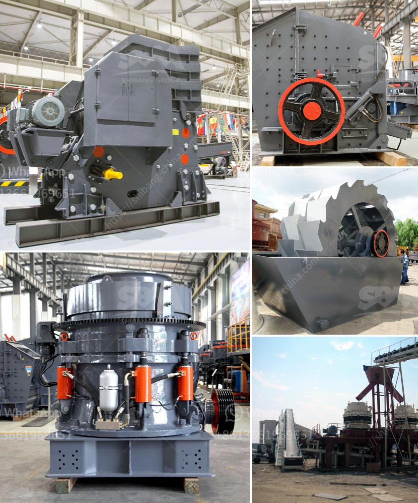

<h3>cement grinding units in india basalt crusher quotes</h3>
Cement industry in India is growing at a steady pace due to the increase in infrastructure development. This has led to the demand for cement grinding units, which are essential for producing cement in large quantities. One such unit is the cement grinding unit at Basalt Crusher.

Cement grinding units in India are located in various states and are spread across the country. These units mostly produce Portland cement, which is used for constructing buildings and infrastructure. Basalt Crusher, a well-known name in the industry, has been supplying these grinding units to the market for several years.

The process of cement grinding involves crushing limestone or other raw materials to a fine powder called cement. The powder is then mixed with water and the resulting mixture is heated and cooled multiple times to form clinker. This clinker is then ground to produce cement.

The cement grinding units at Basalt Crusher utilize the latest technology to grind the clinker and produce high-quality cement. The grinding process is highly efficient as it uses power-saving techniques and is capable of producing cement of fine quality. The units are also equipped with pollution control devices to ensure that the emissions are within the permissible limits set by regulatory authorities.

The cement grinding units at Basalt Crusher are known for their robust construction and durability. They are easy to operate and require minimal maintenance, making them an ideal choice for cement manufacturers. Moreover, the units are cost-effective and offer competitive pricing, making them a preferred choice in the market.

Overall, cement grinding units play a crucial role in the cement industry in India. They ensure efficient production of cement and contribute to the growth of the infrastructure sector. The units at Basalt Crusher are highly reliable and offer excellent quality cement, making them a popular choice among cement manufacturers in India.
<h3>Contact us</h3><ul><li><strong>Whatsapp:&nbsp;<a href="https://wa.me/8613661969651">+8613661969651</a></strong></li><li><a href="https://swt.shibang-china.com/?git&amp;zhl&amp;cement grinding units in india basalt crusher quotes"><strong>Online Service(chat now)</strong></a></li></ul><h3>Related</h3><ul><li><a href='conveyor belt manufacturer in saudi arabia.md'>conveyor belt manufacturer in saudi arabia</a></li><li><a href='feldspar powder ball mill.md'>feldspar powder ball mill</a></li><li><a href='ball mill crusher efficiency.md'>ball mill crusher efficiency</a></li><li><a href='mobile crusher plant south africa.md'>mobile crusher plant south africa</a></li><li><a href='stone crushers industries in west bengal.md'>stone crushers industries in west bengal</a></li></ul>