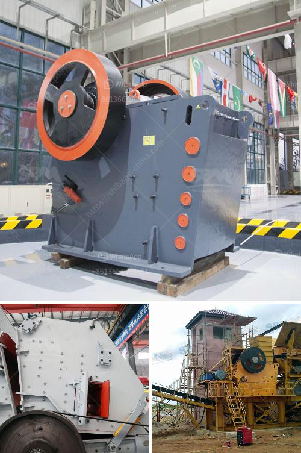

<h3>cement mobile laying block making machine</h3>
The advancements in technology have had a profound impact on various industries, and the construction sector is no exception. One such technological marvel that has revolutionized the way we build is the cement mobile laying block making machine. This innovative equipment has drastically improved the efficiency and productivity of block making, making construction projects quicker and more cost-effective.

The cement mobile laying block making machine is a portable device that can be easily transported to construction sites. This eliminates the need for manual labor and saves time and effort in transporting blocks from one location to another. The machine is compact, making it suitable for both large-scale projects and smaller construction sites with limited space.

One of the key advantages of the cement mobile laying block making machine is its ability to produce high-quality blocks with precision and accuracy. The machine is equipped with state-of-the-art technology that ensures consistent shape, size, and strength of the blocks. This not only enhances the structural integrity of the buildings but also minimizes wastage, as each block is precisely made according to project specifications.

Furthermore, the cement mobile laying block making machine operates on a fully automated system, reducing the need for manual intervention. This means that once the machine is set up and the raw materials are loaded, it can continue to produce blocks without constant supervision. This allows workers to focus on other aspects of construction, resulting in increased productivity and reduced labor costs.

The machine is user-friendly and requires minimal training to operate. The controls are intuitive, and any adjustments or modifications can be made easily. This means that construction companies can quickly adapt to using the cement mobile laying block making machine and incorporate it into their existing processes without significant disruptions.

In addition to its efficiency and ease of use, the cement mobile laying block making machine is also environmentally friendly. It consumes less energy compared to traditional block-making methods, reducing the carbon footprint of construction projects. Moreover, the machine utilizes recycled materials, such as fly ash and industrial waste, which adds an element of sustainability to the construction process.

The cement mobile laying block making machine offers numerous benefits to construction companies, enabling them to streamline their operations and deliver projects on time and within budget. Its mobility, precision, and automation make it a valuable asset for any construction site. By investing in this innovative technology, construction companies can significantly increase their productivity and profitability.

In conclusion, the cement mobile laying block making machine is a game-changer in the construction industry. Its ability to produce high-quality blocks with precision and speed, coupled with its portability and automation, has transformed the way we build. This innovative equipment not only enhances construction operations but also contributes to a more sustainable and efficient construction sector. As technology continues to evolve, we can only expect further advancements in block-making machinery, enabling us to construct buildings faster and smarter than ever before.
<h3>Contact us</h3><ul><li><strong>Whatsapp:&nbsp;<a href="https://wa.me/8613661969651">+8613661969651</a></strong></li><li><a href="https://swt.shibang-china.com/?git&amp;zhl&amp;cement mobile laying block making machine"><strong>Online Service(chat now)</strong></a></li></ul><h3>Related</h3><ul><li><a href='crushing machine manufacturers cape town.md'>crushing machine manufacturers cape town</a></li><li><a href='price for stone crusher.md'>price for stone crusher</a></li><li><a href='the best crusher machines.md'>the best crusher machines</a></li><li><a href='how many jaw crusher manufacturer company in india.md'>how many jaw crusher manufacturer company in india</a></li><li><a href='coarse ash grinding mill equipment.md'>coarse ash grinding mill equipment</a></li></ul>