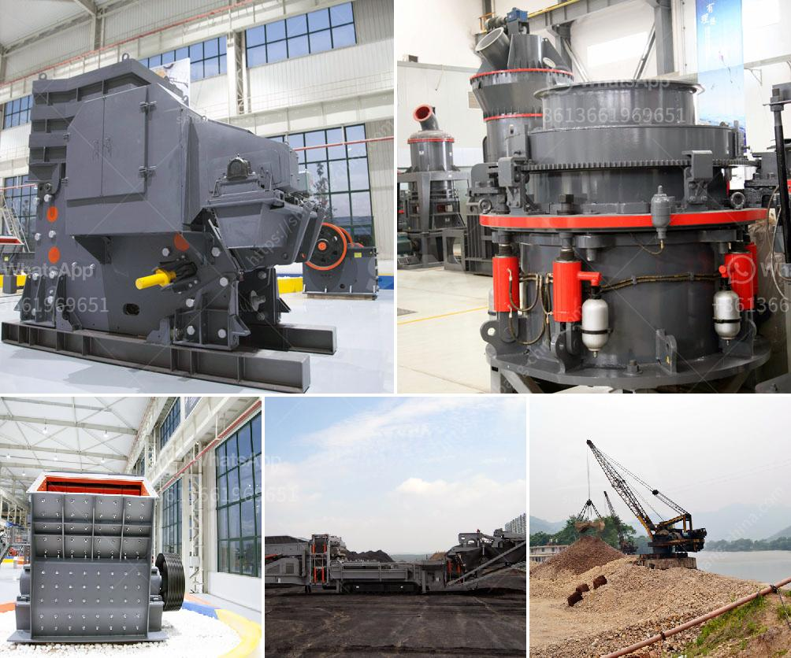

<h3>cement process plant crushing machines manufacturer</h3>
Cement industry is one of the largest industries in the world after water and transportation. These industries contribute significantly to the national, regional, and local economies. With the continuous growth of infrastructure projects, construction activities are increasing, which demands the use of cement in large quantities. 

Cement is the primary binder material used to produce concrete, which is essential in the construction of buildings, bridges, roads, and dams. The cement manufacturing process involves several stages, including crushing, blending, calcining, and grinding of limestone, clay, and other raw materials. After these processes, the resulting mixture, called clinker, is ground into a fine powder called cement.

One of the crucial components of the cement production process is crushing. Various types of crushing machines are used to achieve this task, and each machine has its own unique features and advantages. However, sourcing the best crushing machine manufacturer can be challenging, given the multitude of options available in the market.

When choosing a cement process plant crushing machines manufacturer, it is essential to consider various factors to ensure quality and efficiency. The manufacturer should have a proven track record of delivering reliable and durable machines. They should also have experience in the cement industry and a deep understanding of the specific requirements and challenges faced by cement plants.

A reputable manufacturer will offer a wide range of crushing machines suitable for different stages of the cement production process. These machines should be designed to handle different types of raw materials, such as limestone, clay, shale, and iron ore. They should also be capable of crushing materials of varying sizes and hardness to produce the desired product size.

To ensure optimal performance, the crushing machines should be equipped with advanced features and technologies. These may include hydraulic systems for easy and safe maintenance, high-performance crushing chambers for better efficiency, and intelligent control systems for accurate and consistent production.

In addition to quality and performance, the manufacturer should also provide comprehensive after-sales support and services. This includes installation, commissioning, and training of operators to ensure the machines are operated correctly and efficiently. Regular maintenance and spare parts availability are also crucial factors to consider.

Furthermore, environmental sustainability should be a priority for both the manufacturer and the cement industry. The crushing machines should be designed with energy-efficient features to reduce energy consumption and carbon emissions. Proper dust control measures should also be implemented to minimize air pollution and protect the health of workers and surrounding communities.

In conclusion, choosing the right cement process plant crushing machines manufacturer is vital for the success and efficiency of cement production. The manufacturer should have a proven track record, experience in the industry, and a deep understanding of the specific requirements for cement plants. They should offer a wide range of high-quality machines with advanced features to handle different raw materials efficiently. Additionally, they should provide comprehensive after-sales support and prioritize environmental sustainability. With the right manufacturer, cement plants can achieve optimal production and contribute to the growth and development of the construction industry.
<h3>Contact us</h3><ul><li><strong>Whatsapp:&nbsp;<a href="https://wa.me/8613661969651">+8613661969651</a></strong></li><li><a href="https://swt.shibang-china.com/?git&amp;zhl&amp;cement process plant crushing machines manufacturer"><strong>Online Service(chat now)</strong></a></li></ul><h3>Related</h3><ul><li><a href='picture of a rock crusher machine.md'>picture of a rock crusher machine</a></li><li><a href='cobble stone machine nigeria.md'>cobble stone machine nigeria</a></li><li><a href='rock crusher 500 cubic metre per day.md'>rock crusher 500 cubic metre per day</a></li><li><a href='jaw crusher price.md'>jaw crusher price</a></li><li><a href='sand and gravel suppliers located in cebu.md'>sand and gravel suppliers located in cebu</a></li></ul>