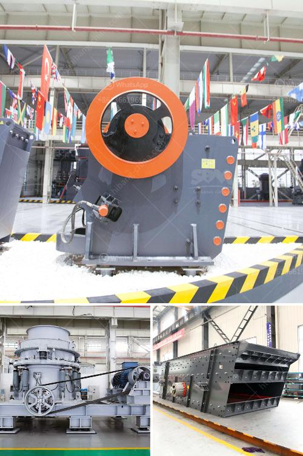

<h3>cement production machinery</h3>
Cement is a vital material used in construction projects worldwide. It is the key ingredient in the production of concrete, which is essential for building foundations, walls, and infrastructure. To meet the ever-increasing demands for cement, advanced machinery is used in the cement production process.

Cement production machinery encompasses various equipment used in different stages of the production process. One of the primary machines is the crusher, which reduces raw material into smaller pieces. Crushers can be jaw crushers, gyratory crushers, or hammer mills, depending on the size and hardness of the material. These machines enable efficient processing of limestone, shale, and other materials into smaller, usable sizes.

The next important machinery is the kiln system, where the raw materials are heated at high temperatures to form clinker. The kiln system consists of a rotary kiln, preheater, and a cooling system. The rotary kiln is the central component, where the raw materials undergo a series of chemical reactions, transforming them into clinker. The preheater and cooling system aid in temperature control, energy conservation, and waste heat recovery.

Another crucial machine employed in cement production is the cement mill. This equipment grinds the clinker into fine powder, along with gypsum, to produce cement. Different types of mills, such as ball mills, vertical roller mills, and roller press machines, are used to achieve the desired particle size and production capacity.

Moreover, material handling equipment plays a significant role in cement production. This equipment includes belt conveyors, bucket elevators, and screw conveyors. They facilitate the transportation of raw materials, clinker, additives, and finished cement between various stages of the production process.

Advanced automation and control systems have also revolutionized cement production machinery. These systems monitor and regulate the operation of various machines, optimizing efficiency, reducing energy consumption, and ensuring consistent product quality.

In conclusion, cement production machinery is essential for the efficient manufacturing of cement. Crushers, kiln systems, cement mills, and material handling equipment are key components in this process. With advancements in technology, these machines continue to evolve, meeting the growing demands of the construction industry.
<h3>Contact us</h3><ul><li><strong>Whatsapp:&nbsp;<a href="https://wa.me/8613661969651">+8613661969651</a></strong></li><li><a href="https://swt.shibang-china.com/?git&amp;zhl&amp;cement production machinery"><strong>Online Service(chat now)</strong></a></li></ul><h3>Related</h3><ul><li><a href='mobile crusher capacity per hour.md'>mobile crusher capacity per hour</a></li><li><a href='second hand jaw crusher for sale in harare.md'>second hand jaw crusher for sale in harare</a></li><li><a href='equipment jaw crusher for sale philippine.md'>equipment jaw crusher for sale philippine</a></li><li><a href='bauxite processing plant in taitata.md'>bauxite processing plant in taitata</a></li><li><a href='gold ore processing plant in germany.md'>gold ore processing plant in germany</a></li></ul>