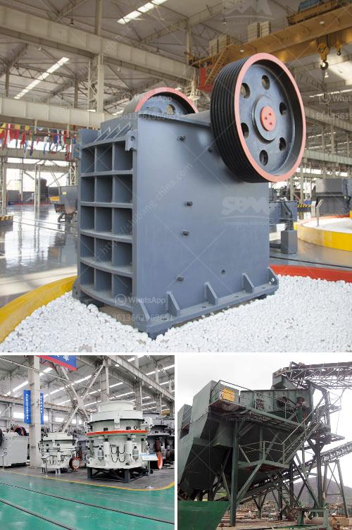

<h3>cement production procedure in vertical mill</h3>
Cement production is a complex process that involves transforming raw materials into a fine powder known as cement clinker. Vertical mills perform this process more efficiently than traditional ball mills. Vertical mills crush the raw materials into particles and then grind them to powder in grinding mills, such as vertical roller mills.

The raw materials undergo several stages of processing before they are ready for cement production. First, limestone and clay are crushed into powder form. This process is accomplished by using crushers or by grinding the materials in a mill. When the powdered raw materials pass through the burning zone, they are calcined, which means they are heated at high temperatures to remove impurities and moisture.

After calcination, the materials are converted into clinker in kilns. The clinker is then ground into a fine powder with gypsum to form cement. In traditional cement production using ball mills, the particles of clinker and gypsum get mixed together. However, in vertical mills, they are crushed separately and then mixed, allowing for better control of the particle size distribution.

Vertical mills have several unique advantages over traditional ball mills. First, vertical mills take up less space, making them more compact and easier to install. They also have a smaller footprint, reducing the environmental impact of cement production. Additionally, they have a lower energy consumption, which makes them more cost-effective in the long run.

The cement production procedure in vertical mills is relatively simple. These mills have a large vertical double-helical steel screw agitator located centrally in a vertical cylindrical shell. The agitator rotates and stirs the raw materials in the grinding zone, allowing them to be ground to the desired fineness.

The processed raw materials are then collected in a cyclone separator or a bag filter, where the fine cement powder is separated from the air stream. The collected powder is transported to a storage silo or directly to packaging for distribution.

Vertical mills are also known for their high grinding efficiency. Compared to ball mills, the power consumption is 20-30% lower for cement grinding and 40-50% lower for slag. The presence of additional drying capabilities in vertical mills also reduces the amount of water that needs to be added to the raw materials prior to entering the mill, thus saving energy.

In conclusion, the cement production process using vertical mills is relatively straightforward. The raw materials are crushed, calcined, and converted into clinker before being ground into fine powder with gypsum. Vertical mills offer several advantages over traditional ball mills, including smaller space requirements, lower energy consumption, and improved control of particle size distribution. This makes them more efficient and cost-effective for cement production.
<h3>Contact us</h3><ul><li><strong>Whatsapp:&nbsp;<a href="https://wa.me/8613661969651">+8613661969651</a></strong></li><li><a href="https://swt.shibang-china.com/?git&amp;zhl&amp;cement production procedure in vertical mill"><strong>Online Service(chat now)</strong></a></li></ul><h3>Related</h3><ul><li><a href='gypsum crusher price in ethiopia.md'>gypsum crusher price in ethiopia</a></li><li><a href='italia dry mortar production line supplier.md'>italia dry mortar production line supplier</a></li><li><a href='gypsum powder production plant ppt.md'>gypsum powder production plant ppt</a></li><li><a href='crusherstone machine in china.md'>crusherstone machine in china</a></li><li><a href='cone crusher manufacturers in usa.md'>cone crusher manufacturers in usa</a></li></ul>