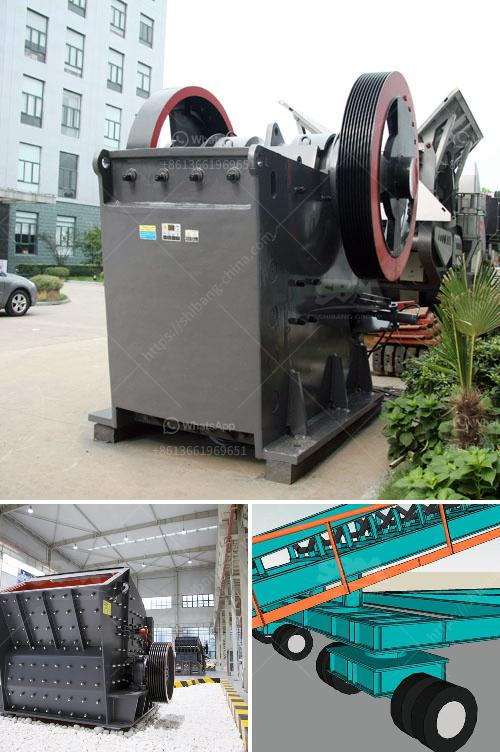

<h3>cement vertical roller mill price in india</h3>
Cement is one of the most important building materials in India. With the booming infrastructure and housing projects, the demand for cement is growing exponentially. As a result, the cement industry is constantly on the lookout for state-of-the-art equipment to improve efficiency and reduce energy consumption.

One such equipment is the cement vertical roller mill. This mill is specifically designed to grind and crush materials used in the cement industry. It is compact, efficient, and reliable, making it a valuable asset for Indian cement manufacturers.

The vertical roller mill uses a grinding roller to pressurize the material bed against the material liner on the grinding table. The grinding efficiency is improved by grinding materials with high pressure, high shear, and extrusion. It is widely used in cement, metallurgy, chemical, electric power, coal, and other industries.

One of the key advantages of the cement vertical roller mill is its low energy consumption. It consumes 20-30% less power compared to traditional grinding mills. This translates into a reduced carbon footprint in the production process. Additionally, the vertical roller mill requires fewer auxiliary equipment and less maintenance, further reducing the overall operational costs.

The vertical roller mill also provides a high grinding efficiency. It can grind various materials into a fine powder, ranging from limestone to coal. The grinding process is precise and consistent, ensuring the desired fineness of the cement. This is particularly important for producing high-quality cement that meets industry standards.

Considering the benefits of the cement vertical roller mill, the price is also an important consideration for Indian cement manufacturers. The price of the vertical roller mill in India ranges from INR 2,00,000 to 10,00,000, depending on various factors such as the capacity, brand, and additional features.

Compared to the ball mill, the vertical roller mill is more cost-effective. It occupies less space, requires less initial investment, and has a lower operational cost. Moreover, the vertical roller mill has a longer service life and requires less maintenance, leading to additional cost savings in the long run.

To ensure a competitive price for the cement vertical roller mill, Indian manufacturers should focus on technological advancements and streamlined production processes. Investing in research and development can lead to innovative design improvements, resulting in more efficient and cost-effective mills.

In conclusion, the cement vertical roller mill is a valuable investment for Indian cement manufacturers. Its low energy consumption, high grinding efficiency, and reduced operational costs make it an attractive choice. With the growing demand for cement in India, investing in a cement vertical roller mill is a smart business move.
<h3>Contact us</h3><ul><li><strong>Whatsapp:&nbsp;<a href="https://wa.me/8613661969651">+8613661969651</a></strong></li><li><a href="https://swt.shibang-china.com/?git&amp;zhl&amp;cement vertical roller mill price in india"><strong>Online Service(chat now)</strong></a></li></ul><h3>Related</h3><ul><li><a href='pebble and basalt production line in panama.md'>pebble and basalt production line in panama</a></li><li><a href='grinding ball for ball mills.md'>grinding ball for ball mills</a></li><li><a href='iron processing equipment.md'>iron processing equipment</a></li><li><a href='pulverizer for ultra fine grinding mill.md'>pulverizer for ultra fine grinding mill</a></li><li><a href='price of hammer mill.md'>price of hammer mill</a></li></ul>