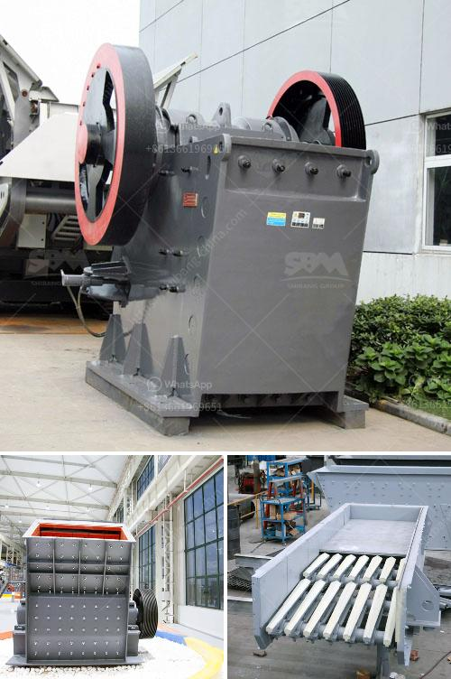

<h3>chain crusher chain crusher suppliers and</h3>
Chain crushers, also called chain mills, are a type of impact crusher that utilize a chain drive system to break down and crush materials. These machines are commonly used in the agriculture, mining, and chemical industries. The primary purpose of a chain crusher is to reduce the size of large debris or waste material into smaller, more manageable pieces. This process is essential for industries that need to process large quantities of materials efficiently.

One of the key components of a chain crusher is the chain links that act as the crushing mechanism. These chains are made up of durable steel and are designed to withstand the high impact and pressure exerted during the crushing process. The chains are attached to a rotating rotor, which spins at high speeds to further break down the material. The design and configuration of the chain links can vary depending on the specific requirements of the application. Some chain crushers have multiple chains, while others may have a single chain with larger links for more robust crushing.

When selecting chain crusher suppliers, it is important to consider several factors to ensure the best possible product and service. Firstly, it is essential to choose a supplier with a proven track record of delivering high-quality chain crushers. This can be determined by researching their reputation within the industry, reading customer reviews, and evaluating their previous projects. A supplier with a strong reputation is more likely to provide durable and reliable chain crushers that can withstand the rigorous demands of industrial applications.

Additionally, it is crucial to consider the supplier's ability to provide after-sales support and maintenance services. Chain crushers can experience wear and tear over time due to the abrasive nature of the materials being processed. Therefore, it is vital to choose a supplier that offers regular maintenance and repair services to keep the equipment in optimal working condition. This can help minimize downtime and ensure maximum productivity.

Furthermore, price competitiveness is another crucial factor when selecting chain crusher suppliers. It is important to evaluate the supplier's pricing compared to other competitors in the market. However, price should not be the sole determining factor, as quality and reliability are equally important. It is advisable to obtain quotes from multiple suppliers and compare them based on the quality, service, and reputation of the supplier.

In conclusion, chain crushers play a vital role in various industries by breaking down large debris and waste materials into smaller, more manageable pieces. When selecting chain crusher suppliers, it is essential to consider their reputation, after-sales support, and price competitiveness. By choosing a reputable supplier, businesses can benefit from durable and reliable chain crushers that enhance their operations and improve overall productivity.
<h3>Contact us</h3><ul><li><strong>Whatsapp:&nbsp;<a href="https://wa.me/8613661969651">+8613661969651</a></strong></li><li><a href="https://swt.shibang-china.com/?git&amp;zhl&amp;chain crusher chain crusher suppliers and"><strong>Online Service(chat now)</strong></a></li></ul><h3>Related</h3><ul><li><a href='gravel manufacturing company in thiruvallur district.md'>gravel manufacturing company in thiruvallur district</a></li><li><a href='list of used machines coal mining.md'>list of used machines coal mining</a></li><li><a href='mobile crusher rental indonesia.md'>mobile crusher rental indonesia</a></li><li><a href='aggregate washing screens in south africa.md'>aggregate washing screens in south africa</a></li><li><a href='mobile jaw crushers.md'>mobile jaw crushers</a></li></ul>