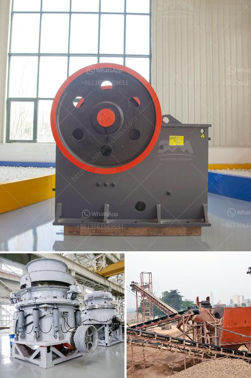

<h3>cheap mobile crusher</h3>
Are you in the market for a reliable and affordable mobile crusher? Look no further! In this article, we will introduce you to the cheap mobile crusher, a cost-effective solution for crushing a wide variety of materials.

The mobile crusher is a versatile machine that can handle a wide range of materials such as limestone, concrete, bricks, asphalt, glass, coal, natural stone, and even reinforced concrete. With a compact design and superior maneuverability, it can easily navigate through narrow passageways or tight spaces.

One of the key advantages of the cheap mobile crusher is its portability. Unlike traditional crushers that require extensive infrastructure and costly transportation, this mobile unit can be easily transported to different job sites. Whether you are working on a construction project or need to process materials on location, this mobile crusher will save you time and money.

Another advantage of the cheap mobile crusher is its flexibility. It can be easily configured to meet your specific crushing needs. With adjustable settings, you can finely tune the output size of the crushed material. Whether you need coarse gravel for road construction or fine aggregate for concrete production, this mobile crusher has got you covered.

In addition to its versatility, the cheap mobile crusher is also known for its efficiency. Equipped with a powerful jaw crusher, it can crush large chunks of material into smaller pieces in a matter of seconds. The mobile crusher is also equipped with a reliable diesel engine that ensures long-lasting performance and low fuel consumption. This means that you can save even more money on operational costs.

Furthermore, the cheap mobile crusher is designed with user-friendliness in mind. Its intuitive control panel allows for easy operation, and the maintenance is straightforward. With minimal downtime, you can maximize the productivity of your crushing operations, ultimately increasing your profitability.

When it comes to affordability, the cheap mobile crusher truly stands out. Despite its low price, it does not compromise on quality or durability. Manufactured with high-quality materials, this mobile crusher is built to last. It can withstand harsh conditions and deliver consistent performance, making it an excellent investment for any small to medium-sized operation.

To summarize, the cheap mobile crusher offers exceptional value for money. Whether you need to process materials on location or are looking for a portable solution for your construction projects, this mobile crusher is the answer. With its versatility, efficiency, and affordability, it is a reliable and cost-effective solution that will meet all your crushing needs.

In conclusion, if you are searching for a reliable and affordable mobile crusher, the cheap mobile crusher is the perfect solution for you. Its portability, versatility, efficiency, and affordability make it a top choice amongst contractors and construction companies. Invest in the cheap mobile crusher and experience the benefits for yourself!
<h3>Contact us</h3><ul><li><strong>Whatsapp:&nbsp;<a href="https://wa.me/8613661969651">+8613661969651</a></strong></li><li><a href="https://swt.shibang-china.com/?git&amp;zhl&amp;cheap mobile crusher"><strong>Online Service(chat now)</strong></a></li></ul><h3>Related</h3><ul><li><a href='vibrating screen price.md'>vibrating screen price</a></li><li><a href='pebble crushing plant.md'>pebble crushing plant</a></li><li><a href='how is calcite used to manufacture paper.md'>how is calcite used to manufacture paper</a></li><li><a href='copper processing stages.md'>copper processing stages</a></li><li><a href='cone crusher instructions.md'>cone crusher instructions</a></li></ul>