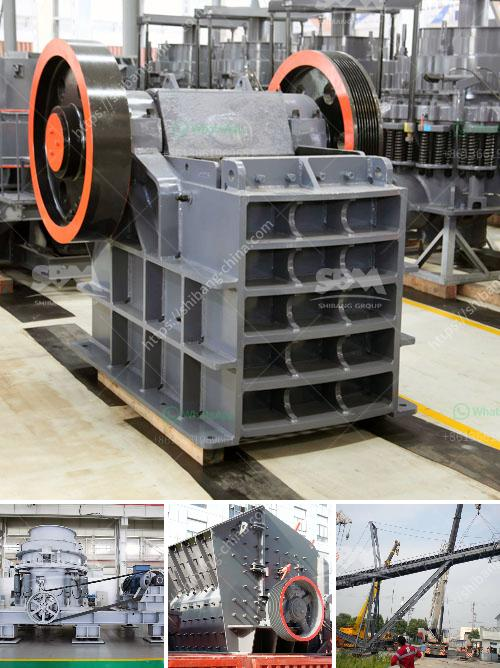

<h3>china clay manufacturing process</h3>
China clay, also known as kaolin, is a white, soft, and powdery mineral that is abundant in nature. It is commonly used in various industries such as paper, ceramics, rubber, paint, and even in skincare products. The manufacturing process of china clay involves a series of steps to achieve the desired quality and purity.

The first step in the manufacturing process is the excavation of the raw material. China clay is primarily found in open-pit mines, where it is extracted using heavy machinery. The mines are carefully selected to ensure the highest quality of clay with the least impurities.

Once the raw material is extracted, it is then transported to the processing plant where it undergoes several processes to remove impurities and refine it further. The clay is typically washed to remove any sand, stones, or other foreign materials. This is done using water and various mechanical methods such as sieving and hydrocyclones.

After washing, the clay is subjected to a process called bleaching. This involves treating the clay with chemicals or high temperatures to remove any organic matter or colored impurities. The bleaching process helps to achieve the desired whiteness and purity of the final product.

Once the clay is bleached, it is then dried to reduce the moisture content. This is important as excessive moisture can affect the quality and performance of the clay. Drying is often done using rotary dryers or flash dryers, where hot air is circulated to remove the moisture from the clay.

After drying, the clay is then pulverized into a fine powder. This is typically done using grinding mills such as roller mills or ball mills. The pulverized clay is then classified into different particle sizes using air classifiers or sieves. This helps to ensure uniformity and consistency in the final product.

The final step in the manufacturing process is the packaging and distribution of the china clay. The powdered clay is packed into bags or containers and labeled according to its quality, grade, and application. It is then ready to be shipped to various industries where it will be used as a raw material or additive.

China clay manufacturing is a complex process that requires careful attention to detail and strict quality control. The raw material extraction, washing, bleaching, drying, pulverizing, and packaging all contribute to the final product's quality and characteristics. With its diverse applications, china clay continues to be in high demand worldwide, making the manufacturing process crucial for meeting industry needs.
<h3>Contact us</h3><ul><li><strong>Whatsapp:&nbsp;<a href="https://wa.me/8613661969651">+8613661969651</a></strong></li><li><a href="https://swt.shibang-china.com/?git&amp;zhl&amp;china clay manufacturing process"><strong>Online Service(chat now)</strong></a></li></ul><h3>Related</h3><ul><li><a href='quarry crusher equipment supplier.md'>quarry crusher equipment supplier</a></li><li><a href='stone crushers machinery in south africa.md'>stone crushers machinery in south africa</a></li><li><a href='lime and dolomite plant division.md'>lime and dolomite plant division</a></li><li><a href='limestone crusher plant.md'>limestone crusher plant</a></li><li><a href='small crusher machine.md'>small crusher machine</a></li></ul>