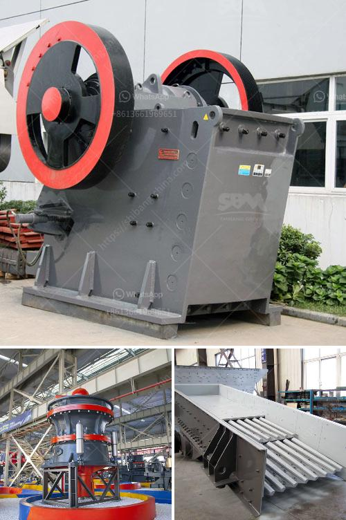

<h3>china crusher manufacturer</h3>
China has become one of the largest manufacturing hubs in the world, producing various products across different industries. One notable sector that has seen tremendous growth in recent years is the crusher manufacturing industry. China has emerged as a prominent crusher manufacturer, catering to the global demand for crushing machines.

With the rapid urbanization and industrialization sweeping across the world, the need for efficient and advanced crushers is on the rise. In this context, Chinese crusher manufacturers have been witnessing significant growth in exports, demonstrating strong market competitiveness. In response to government's call for expanding domestic demands, they have seized the opportunity to ease the pressure of excessive capacity through exporting.

China boasts a rich variety of crusher manufacturers, each with its own strengths and areas of expertise. Among the most prominent ones is Henan Hongxing Mining Machinery Co., Ltd., which has been serving the crushing industry for over 30 years and has earned a solid reputation for market leadership. Their wide range of crushers includes jaw crushers, impact crushers, cone crushers, and mobile crushers, all designed and manufactured to meet market demands.

Another leading Chinese crusher manufacturer is Shandong Jinbaoshan Machinery Co., Ltd., which has been offering high-quality crushers since its establishment in 1983. They have developed a full range of jaw crushers, cone crushers, impact crushers, and vibrating screens, among which the new-generation jaw crushers represent the highest technical and manufacturing knowledge.

China's crusher manufacturers are also embracing the global trend of customization. With customers seeking specialized products, companies like Shanghai Dongmeng Road & Bridge Machinery Co., Ltd. are setting new standards in the crusher industry. They are continuously innovating and upgrading their equipment to cater to specific customer demands, ensuring optimal performance and efficiency.

In conclusion, China's crusher manufacturers are taking the market by storm due to growing demand and fierce competition. With a wide range of crushers of various sizes and capacities, they have become dominant players in the industry. Additionally, their commitment to innovation and customization ensures that customers receive tailor-made solutions for their crushing needs. As China continues to expand its influence in the global market, crusher manufacturers are positioning themselves for further growth and market dominance.
<h3>Contact us</h3><ul><li><strong>Whatsapp:&nbsp;<a href="https://wa.me/8613661969651">+8613661969651</a></strong></li><li><a href="https://swt.shibang-china.com/?git&amp;zhl&amp;china crusher manufacturer"><strong>Online Service(chat now)</strong></a></li></ul><h3>Related</h3><ul><li><a href='used vertical grinder mill for sale.md'>used vertical grinder mill for sale</a></li><li><a href='static jaw crusher for sale in south africa.md'>static jaw crusher for sale in south africa</a></li><li><a href='mobile crusher malaysia for sell.md'>mobile crusher malaysia for sell</a></li><li><a href='stone company profile in china.md'>stone company profile in china</a></li><li><a href='grinding machine specification india price.md'>grinding machine specification india price</a></li></ul>