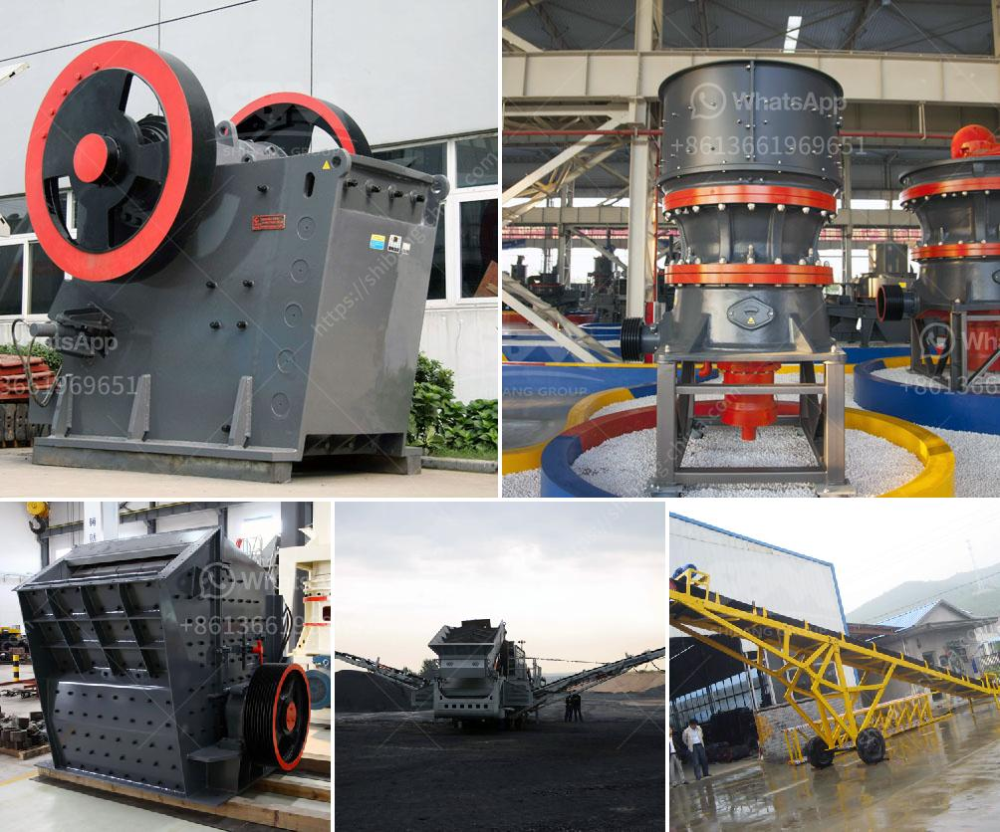

<h3>china crusher sale</h3>
China, known as the leading producer and consumer of various commodities, has always been at the forefront of technological advancement. The country's mining industry has experienced substantial growth over the years, contributing significantly to its economic development. One vital component of this thriving industry is crusher sales.

Crusher sales have played a pivotal role in China's mining sector, as they play an integral part in the process of mineral extraction. Crusher machines are utilized for breaking down big rocks into smaller-sized particles in mining operations. These smaller particles are then further processed to extract valuable minerals such as coal, iron ore, copper, gold, and various other materials.

The crusher market in China is witnessing robust growth due to several factors. Firstly, the government's strong support for infrastructure development has fueled the demand for crushers. The country's ambitious Belt and Road Initiative, which aims to enhance connectivity across continents through infrastructure projects, has created substantial opportunities for crusher sales.

Furthermore, the surge in urbanization and the need for affordable housing have led to increased construction activities. This has, in turn, intensified the demand for crushers, as they are essential in the production of concrete and other building materials. As a result, the construction sector has been a significant driver of China's crusher sales.

Moreover, the rising demand for energy resources, such as coal and iron ore, has bolstered the mining sector in China. The use of crushers is vital in the extraction of these resources, thereby augmenting the growth of the crusher market. China, being the world's largest consumer of coal and the largest steel producer, accounts for a significant share of global crusher sales.

China's crusher industry has witnessed significant technological advancements, which have enhanced the efficiency and productivity of crushers. Advanced technologies such as hydraulic systems, computerized automation, and intelligent control systems have made crushers more reliable, safer, and easier to operate. This has contributed to increased sales as mining companies seek to upgrade their equipment to improve productivity.

The crusher market in China is highly competitive, with both domestic and international players vying for a share of the market. Domestic manufacturers have a substantial advantage due to their low-cost production capabilities and a better understanding of the local market. However, international players bring in advanced technology and global expertise, which gives them a competitive edge.

In recent years, China has also been focusing on sustainable development and environmental conservation. Stringent regulations have been implemented to reduce pollution and promote green mining practices. As a result, crusher manufacturers have been encouraged to develop eco-friendly and energy-efficient crushers. This has spurred research and development in the industry, leading to the introduction of innovative and sustainable crusher models.

In conclusion, the sale of crushers in China has been instrumental in the growth of the mining industry. With the government's support for infrastructure development, increasing urbanization, and rising demand for energy resources, the crusher market is poised for further expansion. The industry's focus on technological advancements and sustainable practices will drive future growth and cement China's position as a global leader in the mining sector.
<h3>Contact us</h3><ul><li><strong>Whatsapp:&nbsp;<a href="https://wa.me/8613661969651">+8613661969651</a></strong></li><li><a href="https://swt.shibang-china.com/?git&amp;zhl&amp;china crusher sale"><strong>Online Service(chat now)</strong></a></li></ul><h3>Related</h3><ul><li><a href='graphite ore beneficiation.md'>graphite ore beneficiation</a></li><li><a href='how is calcite used to manufacture paper.md'>how is calcite used to manufacture paper</a></li><li><a href='iron ore smelter equipment.md'>iron ore smelter equipment</a></li><li><a href='mobile crusher plant south africa.md'>mobile crusher plant south africa</a></li><li><a href='small gold froth flotation unit.md'>small gold froth flotation unit</a></li></ul>