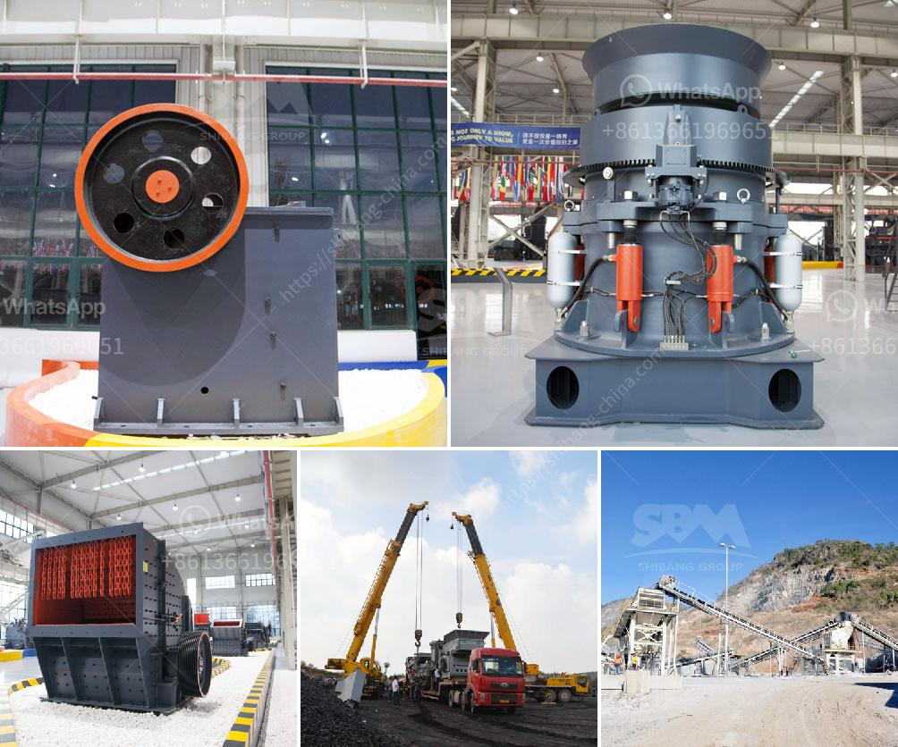

<h3>china gold processing plant</h3>
China is a global leader in gold production and has become a popular destination for gold processing plants. With its rich reserves of the precious metal, China has established itself as a major player in the gold industry, attracting both domestic and international investors.

One such gold processing plant in China is located in the city of Jinfeng, in the Guizhou province. This plant, owned by China National Gold Group Corporation, is one of the largest and most advanced gold processing facilities in the country.

The Jinfeng gold processing plant is equipped with state-of-the-art technology and employs modern techniques to extract gold from its ore. The plant has a processing capacity of about 30,000 tonnes of ore per day and produces approximately 200,000 ounces of gold per year.

One of the notable features of the Jinfeng gold processing plant is its use of environmentally friendly practices. The plant employs several innovative techniques to minimize its impact on the environment, such as reusing water and reducing carbon emissions. It also has a comprehensive waste management system that ensures the proper disposal of any by-products from the gold extraction process.

In addition to its eco-friendly practices, the Jinfeng gold processing plant also prioritizes worker safety. The plant strictly adheres to safety regulations and provides its employees with regular training on safety procedures and practices. This commitment to worker safety has earned the plant a reputation as a responsible and reliable employer among the local community.

The establishment of advanced gold processing plants like the one in Jinfeng has greatly contributed to China's gold production and has boosted the country's economy. The gold industry has played a significant role in China's economic growth, providing jobs and generating revenue for the government.

Furthermore, the presence of such processing facilities has attracted foreign investors who are keen to tap into China's abundant gold reserves. These investors bring in valuable expertise, technology, and capital, which further enhances the efficiency and productivity of gold processing in the country.

In conclusion, China's gold processing plants, such as the Jinfeng facility, play a crucial role in the country's gold production and economic development. These plants leverage advanced technology, eco-friendly practices, and a focus on worker safety to ensure efficient and responsible gold extraction. The presence of these facilities has not only boosted China's gold production but also attracted foreign investors, stimulating further growth in the industry. Overall, China's gold processing plants are at the forefront of the global gold industry and are poised to continue their success in the years to come.
<h3>Contact us</h3><ul><li><strong>Whatsapp:&nbsp;<a href="https://wa.me/8613661969651">+8613661969651</a></strong></li><li><a href="https://swt.shibang-china.com/?git&amp;zhl&amp;china gold processing plant"><strong>Online Service(chat now)</strong></a></li></ul><h3>Related</h3><ul><li><a href='used hammer mill for sale in south africa.md'>used hammer mill for sale in south africa</a></li><li><a href='hammer mill ghana.md'>hammer mill ghana</a></li><li><a href='price for stone crusher.md'>price for stone crusher</a></li><li><a href='mobile crusher india.md'>mobile crusher india</a></li><li><a href='fine grinding equipment.md'>fine grinding equipment</a></li></ul>