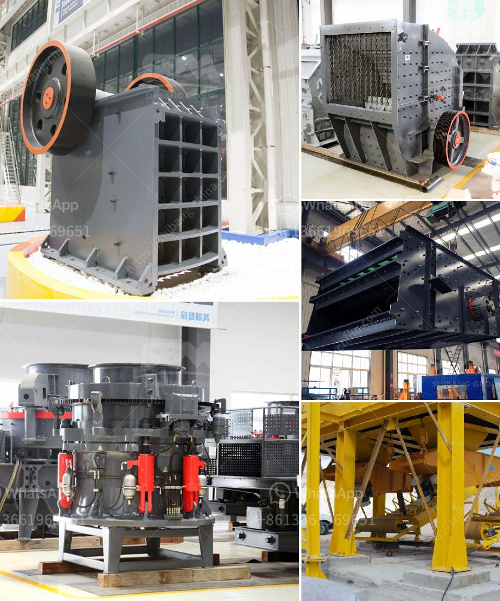

<h3>china quarrying machine prices china</h3>
China has seen rapid industrialization over the past few decades, leading to an increased demand for construction materials, such as stone, gravel, and sand. With the country's vast natural resources at hand, quarrying machines have become an essential part of the construction industry in China. In this article, we will explore the China quarrying machine prices, the factors influencing them, and the competitive nature of the market.

China's quarrying machine prices vary depending on several factors, such as the machine type, brand, and specifications. In general, prices range from a few thousand dollars to several hundred thousand dollars. The variation in prices is often related to the size and capacity of the machine, as well as the complexity of its functions.

One of the most popular types of quarrying machines in China is the stone cutting machine. This machine is used for cutting various types of stones, including granite, marble, limestone, and sandstone. The prices of stone cutting machines in China range from around $5,000 to $150,000, depending on the size, power, and functionalities.

Another commonly used quarrying machine in China is the rock drilling machine. These machines are used for drilling holes in rocks for blasting or extracting minerals. The prices of rock drilling machines in China vary widely, depending on the drilling depth, power, and precision. They can range from $2,000 for a small portable machine to $300,000 for a large, high-powered machine.

The market for quarrying machines in China is highly competitive, with numerous domestic and international manufacturers vying for customers. Some of the prominent Chinese manufacturers include XCMG, Sany, and Liugong. These manufacturers offer a wide range of quarrying machines, catering to different customer needs and budgets.

Competition among manufacturers has led to a downward pressure on prices, making quarrying machines relatively affordable in China. At the same time, manufacturers focus on improving product quality, reliability, and efficiency to stay competitive. This competition benefits the customers as they get access to better machines at reasonable prices.

In addition to price and quality, Chinese manufacturers also provide after-sales services such as maintenance, spare parts, and technical support. This comprehensive support ensures that customers have a smooth experience with their machines, enhancing their satisfaction and loyalty.

China's quarrying machine market is not limited to domestic demand. Chinese manufacturers also export their machines to various countries around the world. The competitive pricing, coupled with the reputation of Chinese manufacturers for producing reliable and durable machines, has contributed to the popularity of Chinese quarrying machines in the global market.

To conclude, quarrying machine prices in China vary depending on factors such as machine type, brand, and specifications. The market is highly competitive, with numerous manufacturers offering a wide range of machines at different price points. This competition has not only driven prices down but also improved the quality and reliability of quarrying machines in China. As the demand for construction materials continues to rise, China's quarrying machine market is poised to grow further, both domestically and globally.
<h3>Contact us</h3><ul><li><strong>Whatsapp:&nbsp;<a href="https://wa.me/8613661969651">+8613661969651</a></strong></li><li><a href="https://swt.shibang-china.com/?git&amp;zhl&amp;china quarrying machine prices china"><strong>Online Service(chat now)</strong></a></li></ul><h3>Related</h3><ul><li><a href='difference between underground and open cast mining.md'>difference between underground and open cast mining</a></li><li><a href='crusher equipment for sale.md'>crusher equipment for sale</a></li><li><a href='jaw crusher quotes.md'>jaw crusher quotes</a></li><li><a href='discharge chute for ball mill.md'>discharge chute for ball mill</a></li><li><a href='stone crushing business plan.md'>stone crushing business plan</a></li></ul>