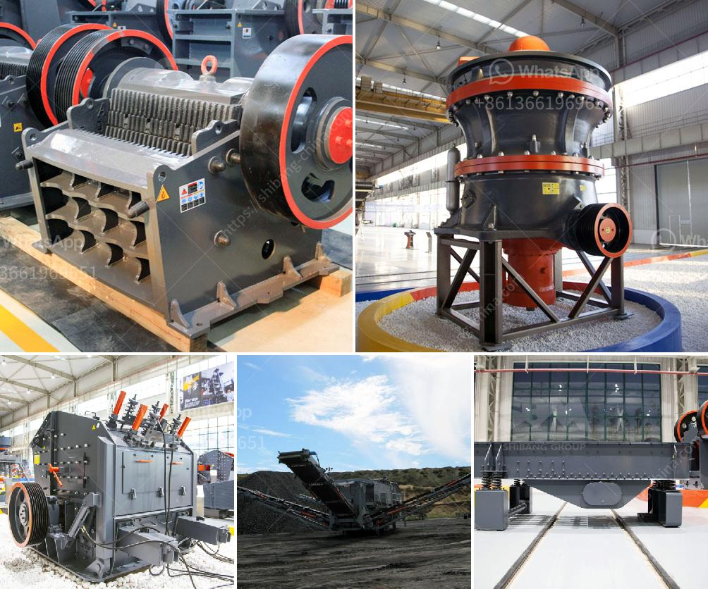

<h3>china rock crusher</h3>
China, being the world’s largest producer of rock crushers, has revolutionized the mining industry with its high-quality and efficient machinery. There are several types of rock crushers available in the market including compression crushers, impact crushers, and cone crushers. These rock crushers are used to process large rocks into smaller aggregates for the construction industry and other purposes.

One of the most popular rock crushers in China is the jaw crusher, which is commonly used as the primary crusher in mining operations. It ensures the crushing process is done efficiently by breaking down the rocks into smaller pieces. The jaw crusher is capable of crushing rocks with compressive strength up to 320MPa.

Another widely used rock crusher in China is the impact crusher, which is often used for secondary crushing. It has a strong impact force and is capable of producing uniform-sized aggregates. The impact crusher is typically used to crush medium-hard rocks, such as limestone, granite, and concrete.

China also produces cone crushers, which are used for crushing ores and rocks. These crushers are equipped with a rotating mantle and a concave bowl liner. The cone crusher is commonly used for secondary or tertiary crushing and is capable of producing a variety of sized aggregates.

In addition to these common types of rock crushers, China also manufactures specialized crushers for different applications. For example, the roll crusher is used for crushing brittle materials, such as coal and limestone. It features a pair of large rolls that rotate against each other, crushing the material between them.

The rock crushers produced in China are designed to meet the strict quality standards required in the mining industry. They are built with durable materials and advanced technology to ensure reliable performance and long service life. China's rock crushers are known for their high productivity, low operating costs, and easy maintenance.

Furthermore, China's rock crushers are also environmentally friendly. Many crushers are equipped with dust suppression systems to minimize the emission of dust and other pollutants. This is an important feature, especially in areas where air quality regulations are strict.

China's rock crushers have played a significant role in the development of the mining industry. They have improved the efficiency of ore extraction, reduced labor costs, and increased overall productivity. With the continuous advancement of technology, China's rock crushers are expected to become even more efficient and reliable in the future.

In conclusion, China's rock crushers have revolutionized the mining industry with their high-quality machinery and efficient performance. They have become an essential tool for crushing and processing large rocks into smaller aggregates. With their durability, low operating costs, and environmentally friendly features, China's rock crushers are a game changer in the mining industry.
<h3>Contact us</h3><ul><li><strong>Whatsapp:&nbsp;<a href="https://wa.me/8613661969651">+8613661969651</a></strong></li><li><a href="https://swt.shibang-china.com/?git&amp;zhl&amp;china rock crusher"><strong>Online Service(chat now)</strong></a></li></ul><h3>Related</h3><ul><li><a href='mobile vibrating screen.md'>mobile vibrating screen</a></li><li><a href='crushing and screening of manganese ore.md'>crushing and screening of manganese ore</a></li><li><a href='price of mining conveyor belt in south africa.md'>price of mining conveyor belt in south africa</a></li><li><a href='stone crusher machine in malaysia.md'>stone crusher machine in malaysia</a></li><li><a href='principle of roller mill.md'>principle of roller mill</a></li></ul>