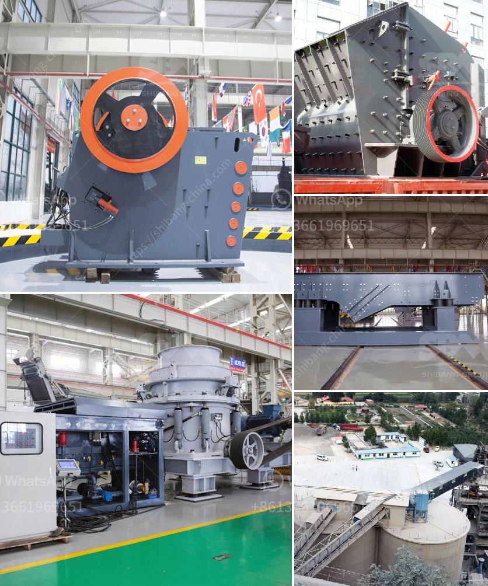

<h3>chinese jaw crusher</h3>
The jaw crusher has always been an essential piece of equipment in the mining and quarrying industries. Its versatility and simplicity have ensured its popularity amongst operators of all experience levels. Over the years, the Chinese jaw crusher manufacturers have evolved in their production capabilities. Today, the Chinese crusher manufacturers offer jaw crushers in multiple configurations, capable of handling different types of materials.

One of the notable Chinese manufacturers is Shanghai Clirik Machinery Co., Ltd. It specializes in the production of jaw crushers, impact crushers, and other mining machinery. With more than 20 years of experience in manufacturing jaw crushers, the company has established itself as one of China's leading manufacturers.

The Chinese jaw crushers are widely used in industries such as mining, building materials, and metallurgy. They are suitable for crushing a variety of materials, including hard stones, ores, and minerals, with a compressive strength of up to 320 MPa. The jaw crusher has a simple structure, reliable operation, and low operating costs. It is widely used in medium-sized crushing operations in various industries.

One of the key features of Chinese jaw crushers is their high crushing ratio. The ratio of the size of the input material to the crushed material is an important factor in determining the efficiency of a crushing machine. Chinese jaw crushers offer a high crushing ratio, which means more efficient crushing of materials, resulting in lower energy consumption.

Another notable feature of Chinese jaw crushers is their excellent performance in the crushing of hard materials. Chinese manufacturers use superior quality materials, such as high manganese steel, in the construction of their jaw crushers. This ensures the durability and longevity of the crushers, even when used in demanding conditions.

Chinese jaw crushers also offer the advantage of easy maintenance. Most Chinese manufacturers design their jaw crushers with accessibility in mind, making it easier for operators to access the crucial parts of the machine for maintenance and repairs. This reduces downtime and increases the overall efficiency of the crushing operation.

In addition to the above features, Chinese jaw crushers often come with optional extras that further enhance their functionality. For example, some models may include a hydraulic toggle system, which allows for smoother operation and reduces the risk of downtime due to mechanical failures. Others might incorporate adjustable tension rods, which provides finer adjustments for controlling the size of the output material.

In conclusion, the Chinese jaw crushers have come a long way in terms of design, performance, and durability. They are widely used in the mining and quarrying industries, proving their effectiveness in handling a variety of materials. With their high crushing ratios, low energy consumption, and easy maintenance, Chinese jaw crushers are a reliable choice for any crushing application. As Chinese manufacturers continue to innovate and improve their products, the jaw crushers' popularity is expected to grow further in the years to come.
<h3>Contact us</h3><ul><li><strong>Whatsapp:&nbsp;<a href="https://wa.me/8613661969651">+8613661969651</a></strong></li><li><a href="https://swt.shibang-china.com/?git&amp;zhl&amp;chinese jaw crusher"><strong>Online Service(chat now)</strong></a></li></ul><h3>Related</h3><ul><li><a href='gemstone mining crusher in zambia.md'>gemstone mining crusher in zambia</a></li><li><a href='petroleum coke grinding.md'>petroleum coke grinding</a></li><li><a href='jual jaw crusher 400 x.md'>jual jaw crusher 400 x</a></li><li><a href='crusher equipment for sale.md'>crusher equipment for sale</a></li><li><a href='study of a fero chrome crushing plant.md'>study of a fero chrome crushing plant</a></li></ul>