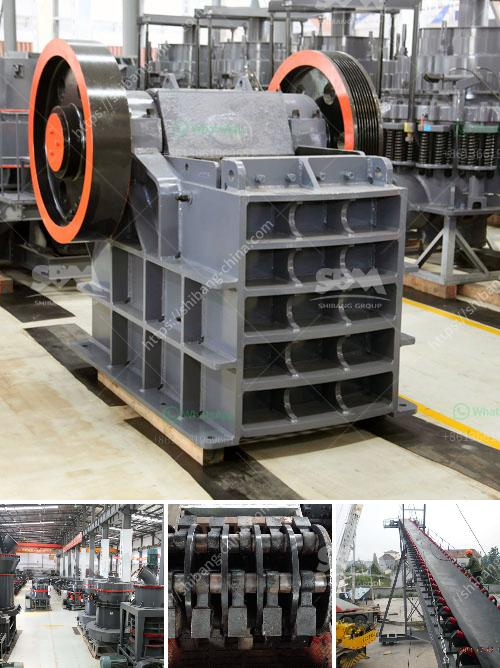

<h3>chrome beneficiation plant design</h3>
Chrome beneficiation plant design means that the equipment configuration should be determined according to the specific situation of the mine, so as to achieve the desired beneficiation effect. The factors affecting the beneficiation process include geological structure, topography, ore properties, and the like. Based on these factors, the beneficiation process is planned to continuously improve the concentration process and improve the economic benefits.

The design of the chrome beneficiation plant should consider these factors: ore properties, such as ore type, geological structure, and ore grade. Ore properties can determine the beneficiation process and equipment selection. The selection of chrome beneficiation plants should consider complete recovery of chrome concentrate to the maximum extent possible. The chrome beneficiation plant design should also consider the maintenance of power, water and other infrastructure.

The chrome beneficiation plant design requires a complete understanding of the physical and chemical properties of the material. At present, the preparation of chromite ore commonly adopts gravity separation where the chrome ore is jigging in the concentrating tank, shaking table, spiral chute and centrifugal concentrator. The final concentrate obtained by the above methods is qualified.

In chrome beneficiation plant design, it is essential to consider these factors: operating, maintenance and manpower costs. The chrome beneficiation plant machines up for sale are from the leading sellers and trusted manufacturers who assure outstanding quality and steady performance for a long time.

To meet the desired performance, the chrome beneficiation plant design may comprise different size separation units by performing different operations such as crushing, grinding, magnetic separation, flotation, and gravity separation. The chrome beneficiation plant design is also adjusted according to the ore grade. Thus, the chrome beneficiation plant design should make full use of effective gravity separation gravity separation methods can produce huge economic benefits.

In conclusion, the chrome beneficiation plant design should be reasonable and efficient, and the guide of actual production conditions should be developed. It not only requires the stable operation of the equipment but also considers the factors such as infrastructure, power supply, and overall design optimization. By carefully considering all these aspects, the design of the chrome beneficiation plant can maximize the recovery of chrome concentrate, therefore improving the overall economic benefits.
<h3>Contact us</h3><ul><li><strong>Whatsapp:&nbsp;<a href="https://wa.me/8613661969651">+8613661969651</a></strong></li><li><a href="https://swt.shibang-china.com/?git&amp;zhl&amp;chrome beneficiation plant design"><strong>Online Service(chat now)</strong></a></li></ul><h3>Related</h3><ul><li><a href='ball mill mesh output.md'>ball mill mesh output</a></li><li><a href='italia dry mortar production line supplier.md'>italia dry mortar production line supplier</a></li><li><a href='gold mining equipment for sale in south africa.md'>gold mining equipment for sale in south africa</a></li><li><a href='calcium carbonate machine supplier in turkey.md'>calcium carbonate machine supplier in turkey</a></li><li><a href='iron ore crusher units in orissa.md'>iron ore crusher units in orissa</a></li></ul>