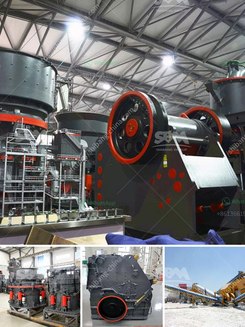

<h3>chrome mining equipment and machinery</h3>
Chrome mining equipment and machinery play a crucial role in the mining of chrome. The equipment is used to extract and process chrome ore and eventually create the final product for use in various industries.

Like mining equipment and machinery in general, chrome mining equipment and machinery are generically categorized into four major groups: extraction, transportation, processing, and storage. Each group serves a vital purpose in the overall chrome mining process.

Firstly, the extraction phase primarily includes the use of large-scale mining machinery such as excavators, loaders, and drill rigs. These machines are responsible for extracting the chrome ore from the ground. Excavators and loaders assist in removing the overburden and transporting it to a suitable location for storage or further processing. Drill rigs are used to create blast holes for controlled explosive blasts that help loosen the chrome ore from the surrounding rock.

Once the chrome ore has been extracted, it is transported to the processing facility. Transportation equipment, such as trucks and conveyor belts, is utilized to move the ore from the mining site to the processing plant. Conveyor belts are particularly efficient for transporting large quantities of chrome ore over long distances quickly.

In the processing phase, specialized equipment is used to separate the chromite from other elements and contaminants. Depending on the desired end product, processing machinery may include crushers, screens, cyclones, gravity concentrators, and spirals. These machines work together to break down the ore, remove impurities, and concentrate the valuable chrome minerals for further refining.

Lastly, storage equipment, such as silos and stockpiles, is employed to store the processed chrome ore before it is transported to the end-users. This equipment ensures efficient management and facilitates easy retrieval of the chrome ore when needed.

In conclusion, chrome mining equipment and machinery are essential for the extraction, transportation, processing, and storage of chrome ore. These tools and machines enable efficient and safe mining operations and ensure the production of high-quality chrome products that are used in various industries worldwide.
<h3>Contact us</h3><ul><li><strong>Whatsapp:&nbsp;<a href="https://wa.me/8613661969651">+8613661969651</a></strong></li><li><a href="https://swt.shibang-china.com/?git&amp;zhl&amp;chrome mining equipment and machinery"><strong>Online Service(chat now)</strong></a></li></ul><h3>Related</h3><ul><li><a href='impact crusher specifications.md'>impact crusher specifications</a></li><li><a href='vsi impact crusher.md'>vsi impact crusher</a></li><li><a href='laying of conveyor belting.md'>laying of conveyor belting</a></li><li><a href='crushing equipment aggregates crushing.md'>crushing equipment aggregates crushing</a></li><li><a href='ball crusher gold machine.md'>ball crusher gold machine</a></li></ul>