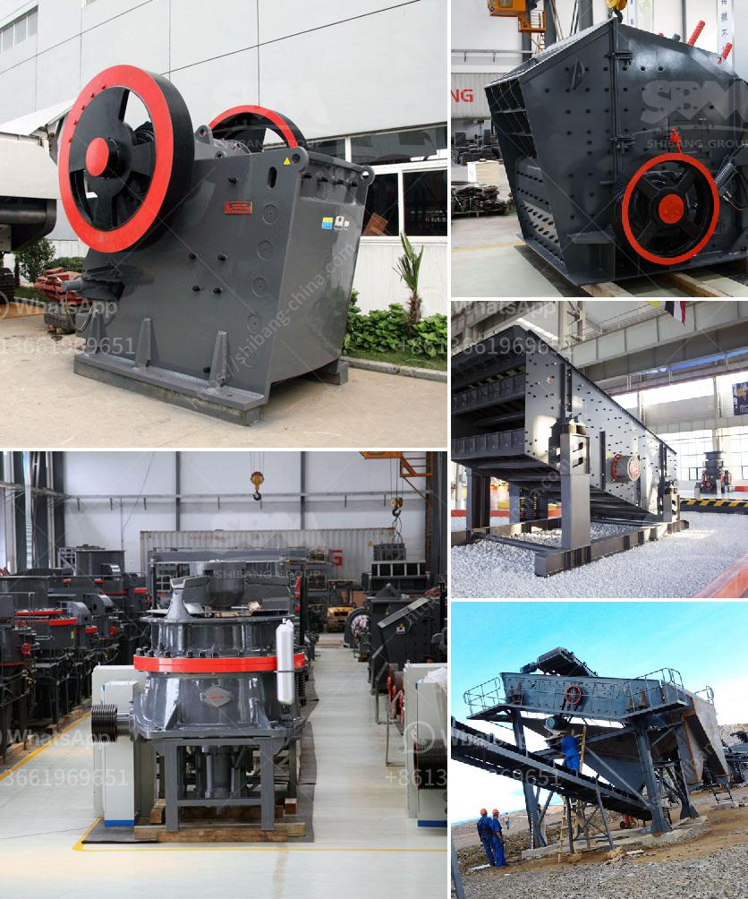

<h3>chrome mining process machines</h3>
Chrome is an essential mineral resource that plays a crucial role in various industrial processes. From stainless steel production to manufacturing specialized alloys, chrome's versatility and durability make it an indispensable material. However, the journey to obtaining this valuable mineral is not as simple as just digging it out of the ground. The chrome mining process involves numerous machines and complex procedures that are necessary for efficient extraction.

The first step in chrome mining is prospecting for deposits. Geologists and experts analyze geological formations to identify areas where chrome is likely to be found. Once a potential deposit is located, the next phase is exploration. Advanced technologies, such as remote sensing and satellite imagery, are used to map the deposit and estimate its size and quality.

After exploration, the mining process begins with the extraction of the ore from the ground. Huge earth-moving machines, such as mining excavators and bulldozers, are used to remove the overburden, which consists of soil and rocks covering the ore body. This step is crucial for proper exposure of the ore and facilitates subsequent operations.

Once the ore is exposed, it is then drilled and blasted to break it into smaller pieces for easier handling. Explosives are carefully used to fragment the ore while minimizing damage to the surrounding rock formations. Following the blasting process, loaders and haul trucks are employed to transport the ore to the crushing plant.

In the crushing plant, various types of crushers are utilized to reduce the size of the ore into manageable fragments. Jaw crushers, cone crushers, and impact crushers are commonly used to break down the ore further. This step is crucial to ensure efficient grinding and separation processes later on.

The next stage in the chrome mining process involves grinding and milling the ore. Grinding mills, such as ball mills or rod mills, pulverize the ore into fine particles. Water and chemicals, known as reagents, are often added to aid in separating the valuable chrome from the waste. Flotation machines and magnetic separators are employed in these separation processes to concentrate the chrome.

The final step in the chrome mining process is smelting. Electric furnaces or rotary kilns are used to heat the concentrated chrome to extremely high temperatures. This results in the production of molten metal, which can then be used for various applications.

In conclusion, the mining of chrome involves a meticulously planned process that relies on various machines and techniques. From prospecting to smelting, each step is vital in converting raw ore into useful chrome. By employing the right machines and practices, the mining industry ensures the sustainable extraction and utilization of this valuable mineral.
<h3>Contact us</h3><ul><li><strong>Whatsapp:&nbsp;<a href="https://wa.me/8613661969651">+8613661969651</a></strong></li><li><a href="https://swt.shibang-china.com/?git&amp;zhl&amp;chrome mining process machines"><strong>Online Service(chat now)</strong></a></li></ul><h3>Related</h3><ul><li><a href='rotary dryer sales indonesia.md'>rotary dryer sales indonesia</a></li><li><a href='chrome ore ferro chrome plant construction plants.md'>chrome ore ferro chrome plant construction plants</a></li><li><a href='diamond stone crusher price list.md'>diamond stone crusher price list</a></li><li><a href='crusher philippines.md'>crusher philippines</a></li><li><a href='selling conveyor belts in kenya.md'>selling conveyor belts in kenya</a></li></ul>