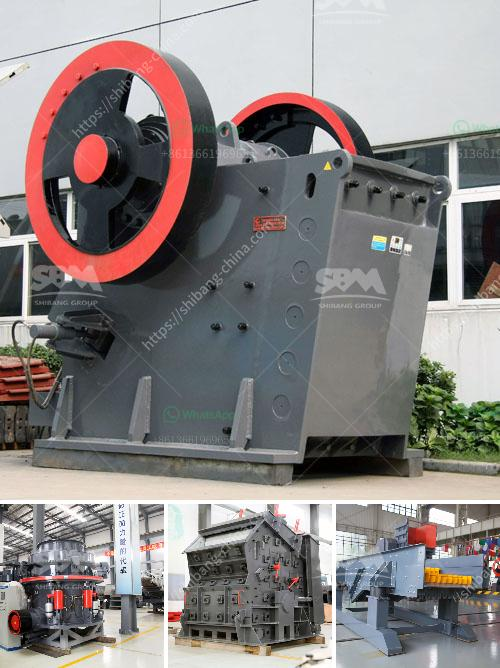

<h3>chrome ore crushers and screeners for hire in south africa</h3>
Chrome ore is a valuable commodity in the mining industry. It is primarily used in the production of stainless steel and other high-end products. This ore is naturally abundant in the African continent, specifically in South Africa. Chrome crushers and screeners for hire in South Africa play a crucial role in the mining industry. With the continuous development of infrastructure in South Africa, the demand for chrome has been steadily increasing, and the country has vast chrome ore deposits.

Chrome crushers and screeners for hire offer many benefits, such as cost-effectiveness, versatility, and convenience. These machines are ideal for processing chrome ore and ensure efficient mining operations. Hiring chrome crushers and screeners in South Africa will provide flexibility and convenience to companies that operate in the mining industry. These machines can be easily transported to different mining sites, reducing downtime and increasing productivity.

The process of mining chrome ore consists of several stages. Initially, the ore is blasted with explosives and then loaded onto trucks for transportation to the primary crusher. The primary crusher reduces the size of the ore into smaller particles for further processing. Depending on the desired size and fineness, secondary and tertiary crushers are used. After the crushing process, the ore is then screened to separate the different sizes and grades of chrome.

Screeners are essential in the mining industry as they efficiently separate the chrome ore into different sizes, grades, and types. This ensures that the ore is processed according to the specific requirements of the end user. Screening the ore also removes any impurities or contaminants present in the material. The screening process is critical as it determines the quality and market value of the final product.

Hiring chrome ore crushers and screeners in South Africa will provide several benefits to mining companies. These machines remove the need for expensive and time-consuming underground mining and are capable of processing a wide range of chrome ore grades. They are also flexible in terms of their working capacity and require minimal supervision during operation. Additionally, hiring chrome crushers and screeners eliminates the need for companies to invest in expensive mining machinery, thereby reducing their capital expenditure.

The availability of chrome crushers and screeners for hire in South Africa is an advantage for companies operating in this industry. They have access to a vast pool of qualified professionals and can also easily scale their operations as per the mining project requirements. Hiring these machines in South Africa also supports the local economy, as it generates employment opportunities and boosts the country's mining sector.

In conclusion, chrome crushers and screeners for hire in South Africa play a crucial role in the mining industry. They are cost-effective, versatile, and provide convenience to mining companies. These machines ensure efficient mining operations by crushing and screening chrome ore into different sizes and grades. Hiring chrome crushers and screeners in South Africa offers several benefits, such as flexibility, reduced downtime, and increased productivity. Moreover, it supports the local economy and contributes to the growth of the mining sector in the country.
<h3>Contact us</h3><ul><li><strong>Whatsapp:&nbsp;<a href="https://wa.me/8613661969651">+8613661969651</a></strong></li><li><a href="https://swt.shibang-china.com/?git&amp;zhl&amp;chrome ore crushers and screeners for hire in south africa"><strong>Online Service(chat now)</strong></a></li></ul><h3>Related</h3><ul><li><a href='puzzolana jaw crusher price in india.md'>puzzolana jaw crusher price in india</a></li><li><a href='rock crusher 500 cubic metre per day.md'>rock crusher 500 cubic metre per day</a></li><li><a href='cec rock crushers for sale.md'>cec rock crushers for sale</a></li><li><a href='rock stone crushing machine in usa.md'>rock stone crushing machine in usa</a></li><li><a href='kaolin portable crusher provider in nigeria.md'>kaolin portable crusher provider in nigeria</a></li></ul>