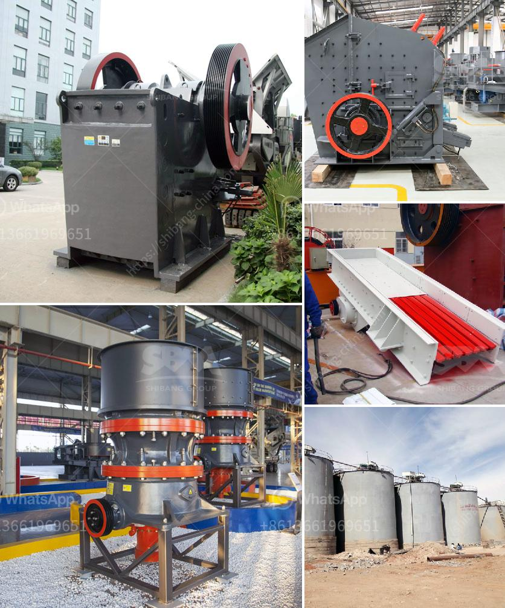

<h3>chrome ore crushers for hire in south africa</h3>
Crushers are popular in the mining industry where they are used to break down large pieces of rock and ore into smaller pieces that can be easily processed for further grinding. Chrome ore crushers are widely used in chromite ore crushing production line. Crushers may be used to reduce the size, or change the form, of waste materials so they can be more easily disposed of or recycled, or to reduce the size of a solid mix of raw materials, making it easier to differentiate between different particles.

South Africa is home to one of the largest chrome ore deposits in the world and miners have been extracting chrome ore for decades in the country. Chrome ore crushers for hire in South Africa are available for clients in different geological conditions that are able to reduce chrome ore sizes for efficient subsequent grinding. Chrome ore crushers for hire in South Africa are a professional type of crushing and grinding equipment, used in the mining industry.

Chrome ore crushers are customized and designed with advanced technology to meet the requirements of different clients. The crushing and grinding machines are designed to suit different tasks, such as crushing the chrome ore in primary, secondary, and tertiary crushing stages. To reduce the chrome ore sizes further, the ore is ground by grinding mills. Crushers and grinding mills are used in all stages of the size reduction process.

- save on transportation costs as crushers can work directly on-site, reducing the need for ore transportation to a centralized processing plant.

- reduce the environmental impact by minimizing waste material from chrome ore mining and processing.

- Capacity: Determine the required crusher capacity based on the volume of chrome ore material to be processed. Ensure that the capacity of the crusher aligns with the production requirements.

- Crushing technology: Choose crushers equipped with advanced crushing technologies, such as hydraulic, mechanical, or impact crushing, to ensure efficient crushing.

- Maintenance and spare parts: Consider the availability of spare parts and maintenance requirements to ensure uninterrupted operation and minimal downtime.

- Budget: Determine the budget available for hiring chrome ore crushers and select the equipment that provides the best value for money.

In conclusion, chrome ore crushers for hire in South Africa are essential equipment in the mining industry, used for breaking down larger pieces of rock and ore into smaller pieces for further processing. Hiring crushers allows for efficient size reduction, reduces operational costs, and minimizes environmental impacts. When hiring crushers, it is important to consider factors such as capacity, crushing technology, maintenance, and budget to select the most appropriate equipment for the job.
<h3>Contact us</h3><ul><li><strong>Whatsapp:&nbsp;<a href="https://wa.me/8613661969651">+8613661969651</a></strong></li><li><a href="https://swt.shibang-china.com/?git&amp;zhl&amp;chrome ore crushers for hire in south africa"><strong>Online Service(chat now)</strong></a></li></ul><h3>Related</h3><ul><li><a href='second hand diamond dms plant for sale kimberly.md'>second hand diamond dms plant for sale kimberly</a></li><li><a href='design and fabrication of ball mill pdf.md'>design and fabrication of ball mill pdf</a></li><li><a href='use of the ball mill.md'>use of the ball mill</a></li><li><a href='small rock crushers in turkey.md'>small rock crushers in turkey</a></li><li><a href='how to get aluminum from bauxite.md'>how to get aluminum from bauxite</a></li></ul>