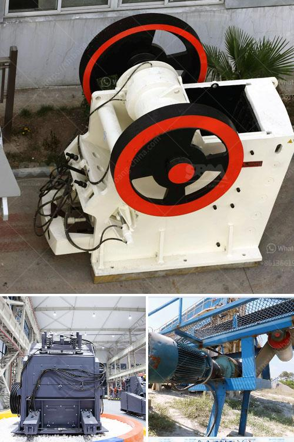

<h3>chrome ore ferro chrome plant construction plants</h3>
The demand for ferrochrome, a key ingredient in stainless steel production, has been steadily increasing in recent years. As a result, chrome ore ferro chrome plant construction plants have become a remarkable investment opportunity for entrepreneurs and investors alike. These plants play a crucial role in meeting the rising global demand for high-quality stainless steel, making them a lucrative business venture.

To understand the significance of chrome ore ferro chrome plants, it is important to first comprehend the production process. Chrome ore, which is primarily found in countries like South Africa, India, and Turkey, is the main raw material used in ferrochrome production. It is typically obtained through open-pit mining or underground mining processes.

Once the chrome ore is extracted, it is transported to ferro chrome plants for further processing. These plants consist of a series of integrated facilities, including crushing and screening units, smelting furnaces, and refining and casting units. The chrome ore is first crushed into small particles and then screened to remove any impurities. It is then heated in smelting furnaces to temperatures exceeding 1600 degrees Celsius, leading to the production of high-carbon ferrochrome.

The construction of chrome ore ferro chrome plants presents various benefits for investors. Firstly, it allows for the transformation of raw chrome ore into a high-value product in the form of ferrochrome. This opens up opportunities for increased revenue generation and attractive profit margins. Moreover, the demand for stainless steel is projected to witness robust growth, driven by industries such as automotive, construction, and consumer goods. This translates into a consistent demand for ferrochrome, consequently creating a sustainable market for chrome ore ferro chrome plants.

In addition to the growing market demand, the construction of these plants also opens doors for employment opportunities. These facilities require skilled labor for efficient operations in various departments, including mining, crushing, smelting, refining, and casting. By contributing to job creation, chrome ore ferro chrome plants positively impact local economies and improve living standards within the surrounding communities.

Furthermore, establishing chrome ore ferro chrome plants contributes to the development of local infrastructure. These plants require access to reliable power supply, water resources, and transportation networks. As a result, investment in the construction of these facilities can lead to the enhancement of existing infrastructure or the development of new infrastructure, benefiting not only the plants but also the surrounding regions.

However, it is important to note that the construction of chrome ore ferro chrome plants does come with certain challenges. Environmental concerns related to mining activities, such as soil erosion, water pollution, and air emissions, need to be addressed through sustainable mining practices and compliance with environmental regulations. Additionally, the volatility of chrome ore prices can impact the profitability of these plants, warranting a thorough understanding of commodity market dynamics and risk management strategies.

In conclusion, the construction of chrome ore ferro chrome plants is a remarkable investment opportunity, driven by the increasing global demand for stainless steel. These plants not only transform raw chrome ore into valuable ferrochrome but also contribute to job creation and local infrastructure development. While challenges exist, diligent market research, risk management strategies, and sustainable mining practices can further capitalize on this investment opportunity. Entrepreneurs and investors who seize the potential of chrome ore ferro chrome plants are poised to unlock long-term growth and profitability in the stainless steel industry.
<h3>Contact us</h3><ul><li><strong>Whatsapp:&nbsp;<a href="https://wa.me/8613661969651">+8613661969651</a></strong></li><li><a href="https://swt.shibang-china.com/?git&amp;zhl&amp;chrome ore ferro chrome plant construction plants"><strong>Online Service(chat now)</strong></a></li></ul><h3>Related</h3><ul><li><a href='kaolin process flow diagram.md'>kaolin process flow diagram</a></li><li><a href='gyratory gyratory crusher manufacturer in india.md'>gyratory gyratory crusher manufacturer in india</a></li><li><a href='stone crushers in atlantico.md'>stone crushers in atlantico</a></li><li><a href='silica water washing plant price.md'>silica water washing plant price</a></li><li><a href='stone crusher plant list odisha.md'>stone crusher plant list odisha</a></li></ul>