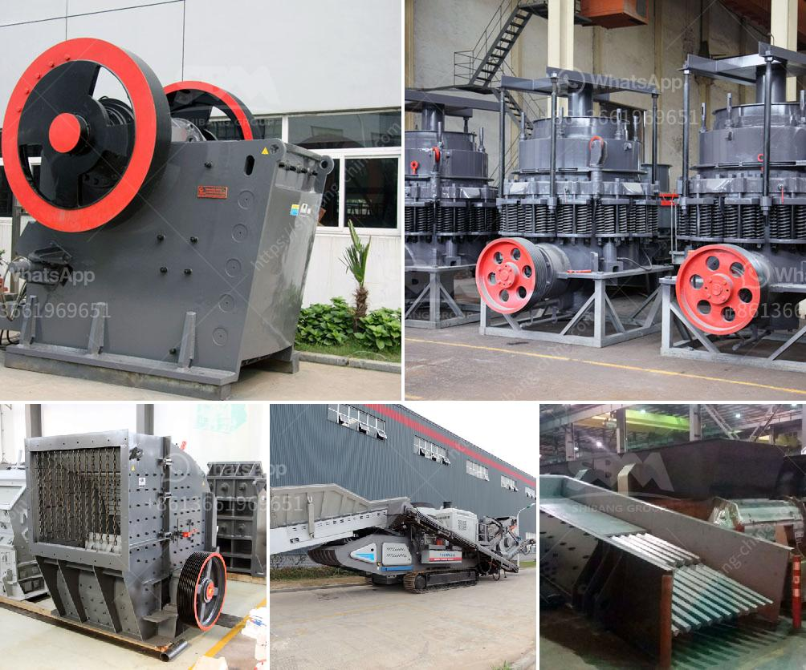

<h3>chrome washing plant in limpopo for rent</h3>
Chrome ore is one of the most valuable resources in the mining sector. With a growing demand for chrome globally, the mineral can be found in different locations around the world. In South Africa, particularly in Limpopo Province, the abundant chrome deposits have led to the establishment of various chrome mining operations.

One essential component in the processing of chrome ore is the chrome washing plant. It plays a crucial role in the extraction and beneficiation of valuable minerals from mined ore. A chrome washing plant is commonly known as a chrome beneficiation plant or chrome recovery plant, which is a combination of chrome crushing, screening, gravity separation, and concentration techniques.

The purpose of a chrome washing plant is to maximize the recovery of valuable chrome concentrate and the recovery of chrome fines from the waste material, thus reducing waste and increasing profitability. Over the years, technological advancements have made chrome washing plants more efficient and cost-effective.

For mining companies or individuals in Limpopo Province seeking a reliable and affordable chrome washing plant, renting may be the ideal solution. Renting a chrome washing plant in Limpopo offers numerous advantages compared to outright purchase or the use of fixed installations.

First and foremost, renting a chrome washing plant allows mining companies to avoid the significant financial burden associated with purchasing, operating, and maintaining the plant. Buying a chrome washing plant requires a substantial upfront investment, which may not be feasible for small or medium-scale mining operations. Renting a plant significantly reduces the initial financial outlay, allowing businesses to allocate their resources more effectively.

In addition to the cost benefits, renting a chrome washing plant also provides mining companies with flexibility and scalability. The mining industry operates in a highly dynamic and unpredictable environment. Renting allows businesses to adapt their chrome processing capacity according to their immediate needs and market demands. If the demand for chrome increases, additional plant capacity can be rented and incorporated seamlessly into the existing operations. On the other hand, if the demand drops or operational parameters change, scaling down or terminating the rental agreement becomes relatively hassle-free.

Moreover, renting a chrome washing plant in Limpopo ensures access to the latest technologies and equipment. Technology is constantly evolving in the mining sector, with new advancements aimed at increasing efficiency and productivity. Renting allows mining companies to enjoy the benefits of cutting-edge equipment and machinery without the need for continuous capital investment.

When considering a chrome washing plant for rent in Limpopo, it is crucial to select a reputable and experienced plant supplier. A reliable supplier will offer various plant options tailored to the mining company's specific requirements. They should also provide comprehensive technical support, efficient maintenance services, and training programs for the plant operators.

To conclude, renting a chrome washing plant in Limpopo is a cost-effective, flexible, and efficient solution for mining companies seeking to process chrome ore. By avoiding the high upfront costs of purchasing and maintaining a plant, businesses can allocate their resources more effectively. This allows for better adaptability to market demands and access to the latest technologies. Mining companies in Limpopo should explore the option of renting a chrome washing plant to improve their chrome ore processing operations and enhance profitability.
<h3>Contact us</h3><ul><li><strong>Whatsapp:&nbsp;<a href="https://wa.me/8613661969651">+8613661969651</a></strong></li><li><a href="https://swt.shibang-china.com/?git&amp;zhl&amp;chrome washing plant in limpopo for rent"><strong>Online Service(chat now)</strong></a></li></ul><h3>Related</h3><ul><li><a href='mobile jaw crushers for sale in italy.md'>mobile jaw crushers for sale in italy</a></li><li><a href='metal pulverizer crusher suppliers.md'>metal pulverizer crusher suppliers</a></li><li><a href='diagram of a hammer mill.md'>diagram of a hammer mill</a></li><li><a href='coal crushing and washing plant for sale south africa.md'>coal crushing and washing plant for sale south africa</a></li><li><a href='production process of calcium carbonate.md'>production process of calcium carbonate</a></li></ul>