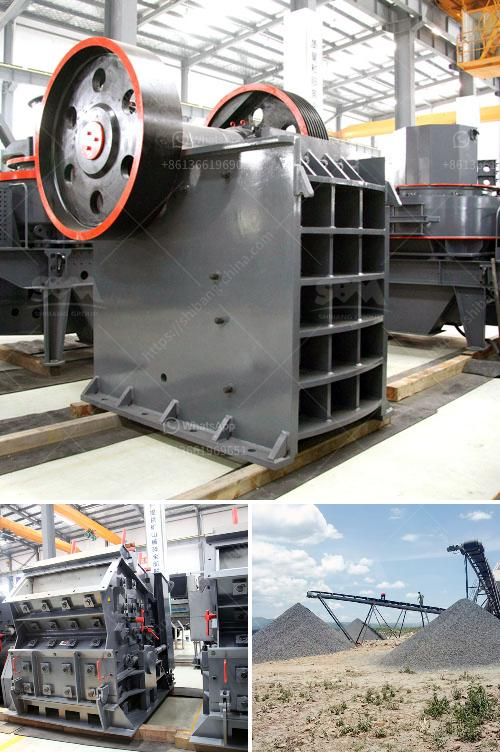

<h3>clay ball mill machine</h3>
The clay ball mill is the key equipment for crushing the material after it has been crushed. Widely used in cement, silicate products, new building materials, refractory materials, fertilizers, black and non-ferrous metal dressings and glass ceramics production industries, dry or wet grinding of various ores and other grindable materials.

The clay ball mill machine is mainly used for wall and floor tile production, and the finished product can be used in ceramics, porcelain enamel, glassmaking and many other industries. The clay ball mill is the key equipment for crushing the material after it has been crushed. It is widely used in cement, silicate products, new building materials, refractory materials, fertilizers, black and non-ferrous metal dressings and glass ceramics production industries, dry or wet grinding of various ores and other grindable materials.

The clay ball mill machine is composed of feeding part, discharging part, turning part and driving part (reducer, small driving gear, electric motor and electric control). The quill shaft adopts cast steel part and the liner is detachable. The turning gearwheel adopts casting hobbing process and the drum is equipped with wear-resistant liner, which has good wear resistance. The machine runs smoothly and works reliably.

One of the main features of the clay ball mill machine is its ability to grind materials under both wet and dry conditions. This versatility is advantageous for materials with fluctuating moisture content. The clay ball mill machine operates with a periodic alternating motion in both the axial and radial directions. This motion ensures a thorough grinding of the material, resulting in a well-dispersed and homogeneous mixture.

The clay ball mill machine is characterized by its high production capacity, strong adaptability to materials, high fineness of the finished product, small occupied area and energy saving. It can be used in both open circuit and closed circuit grinding systems. It can also be operated continuously or intermittently according to the production needs.

In addition, the clay ball mill machine is easy to operate and maintain. It has a simple structure and requires minimal installation space. The machine is equipped with a reliable lubrication system to ensure smooth operation. The wearing parts of the machine are made of high-quality wear-resistant materials, which can greatly extend the service life of the machine.

In conclusion, the clay ball mill machine is an important equipment for crushing and grinding raw materials in the ceramics industry. Its advantages such as high efficiency, strong adaptability, and easy operation make it a preferred choice for many manufacturers. Whether it is used for dry grinding or wet grinding, it can effectively grind various materials, ensuring the quality and fineness of the final product. With continuous technological advancements, the clay ball mill machine will continue to play a crucial role in the ceramics industry.
<h3>Contact us</h3><ul><li><strong>Whatsapp:&nbsp;<a href="https://wa.me/8613661969651">+8613661969651</a></strong></li><li><a href="https://swt.shibang-china.com/?git&amp;zhl&amp;clay ball mill machine"><strong>Online Service(chat now)</strong></a></li></ul><h3>Related</h3><ul><li><a href='cost of the process of mining limestone.md'>cost of the process of mining limestone</a></li><li><a href='quarrying crusher in zimbia.md'>quarrying crusher in zimbia</a></li><li><a href='continuous ball mill manufactures in gujrat.md'>continuous ball mill manufactures in gujrat</a></li><li><a href='hammer mill 150 250.md'>hammer mill 150 250</a></li><li><a href='dolomite crusher manufacturer in usa.md'>dolomite crusher manufacturer in usa</a></li></ul>