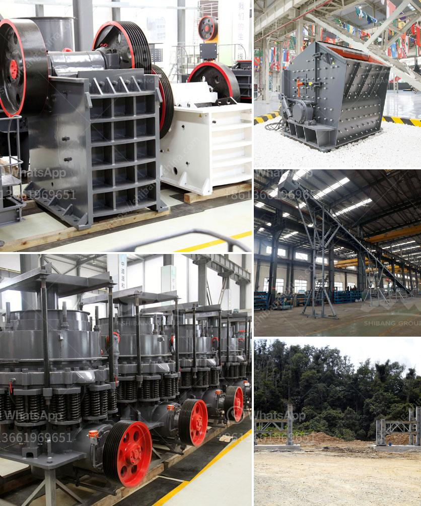

<h3>clay beneficiation</h3>
Clay beneficiation is a process that removes impurities from clay, allowing it to be used in various applications. The process involves crushing, grinding, and washing the clay to remove impurities such as minerals and organic matter.

Clay is a natural material that is composed primarily of fine-grained minerals. It is used in various industries such as construction, ceramics, and agriculture. However, before it can be used, clay needs to be purified to ensure its quality and suitability for the intended application.

The process of clay beneficiation starts with the crushing and grinding of the raw material. This helps break down large chunks of clay into smaller particles. Crushing and grinding also release impurities that may be present in the clay, such as rocks, minerals, and organic matter.

Once the clay is crushed and ground, it is then subjected to washing. Washing is a crucial step in clay beneficiation as it helps remove impurities like sand, silt, and other unwanted materials. The clay is mixed with water and agitated, allowing the impurities to be separated and carried away. This process, known as hydraulic separation, ensures that only the pure clay is obtained.

After washing, the clay is dried to remove any remaining moisture. Drying can be done through various methods, such as air drying or using industrial dryers. The dried clay is then further processed to achieve the desired consistency and particle size. This may involve sieving or pulverizing the clay to achieve a fine and uniform texture.

The purified clay is now ready for its intended application. In the construction industry, clay is often used in the production of bricks, tiles, and cement. The purified clay provides the necessary properties such as plasticity, strength, and durability required for these applications.

In the ceramics industry, clay is the primary material used to produce pottery, porcelain, and other ceramic products. Clay beneficiation ensures that the clay has the right composition and properties required for shaping, firing, and glazing processes.

In agriculture, clay is used for soil improvement and fertility enhancement. Purified clay can be mixed with other additives to create soil amendments that help retain water, improve soil structure, and provide essential nutrients to plants. This improves the overall quality and productivity of agricultural lands.

In conclusion, clay beneficiation is an essential process that removes impurities from clay, making it suitable for a wide range of applications in various industries. The process involves crushing, grinding, washing, and drying clay to obtain a purified and refined material. From construction to ceramics and agriculture, purified clay plays a vital role in numerous applications and contributes to the development of various sectors.
<h3>Contact us</h3><ul><li><strong>Whatsapp:&nbsp;<a href="https://wa.me/8613661969651">+8613661969651</a></strong></li><li><a href="https://swt.shibang-china.com/?git&amp;zhl&amp;clay beneficiation"><strong>Online Service(chat now)</strong></a></li></ul><h3>Related</h3><ul><li><a href='ball mill manufacturers china.md'>ball mill manufacturers china</a></li><li><a href='clay ball mill machine.md'>clay ball mill machine</a></li><li><a href='silica sand mill.md'>silica sand mill</a></li><li><a href='vsi crusher for quartz.md'>vsi crusher for quartz</a></li><li><a href='fine powder grinding machine philippines.md'>fine powder grinding machine philippines</a></li></ul>