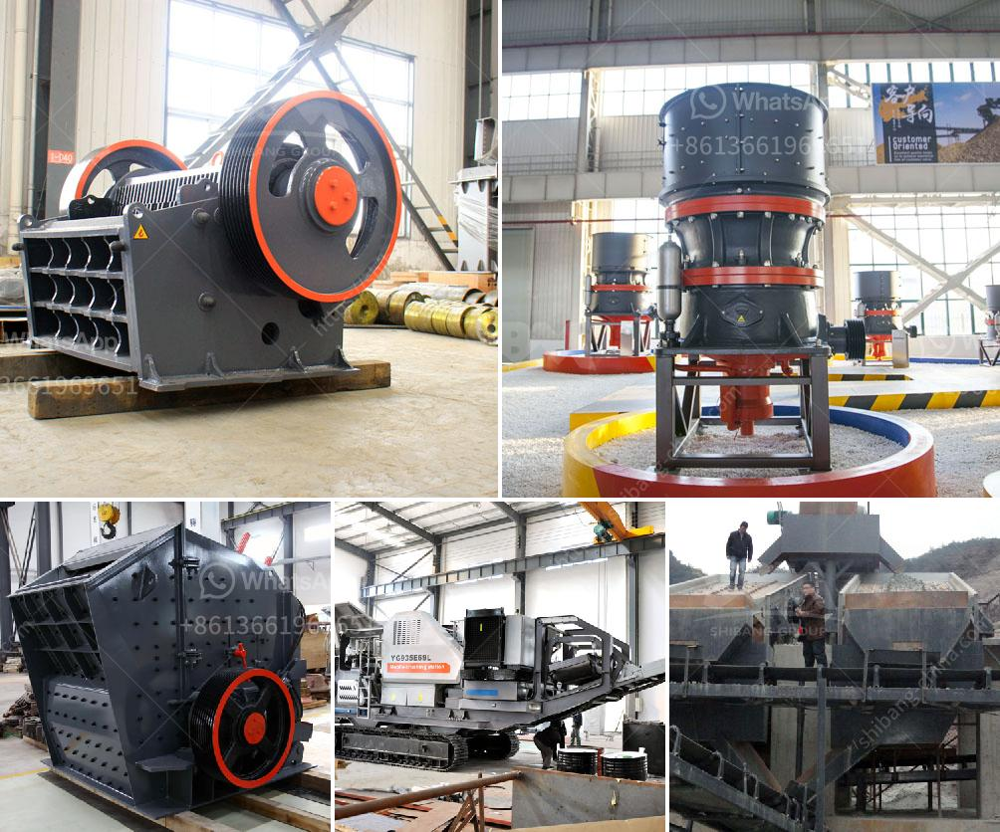

<h3>clay mill machine crusher price</h3>
Clay mill machine, also called crusher machine or clay crusher machine, is a specialized piece of equipment that is used for crushing clay into smaller pieces. It is commonly used in the clay industry to produce various types of clay products such as bricks, ceramics, and even pottery.

The clay mill machine is designed to have a high production capacity while minimizing the energy consumption. This makes it an ideal choice for clay manufacturers who want to increase their productivity without compromising on quality. The machine operates by crushing the clay chunks into smaller particles using a series of rotating hammers or blades. These blades break down the clay material into small chips, allowing it to be easily processed further.

When purchasing a clay mill machine, one of the main factors to consider is the price. The cost of a clay mill machine can vary depending on its size, capacity, and features. Machines with higher production capabilities and advanced features tend to have a higher price tag. On the other hand, smaller machines with lower production capacities are generally more affordable.

A clay mill machine with a higher price may be worth the investment if it can significantly increase your clay production output and improve your overall efficiency. However, it is important to carefully evaluate your needs and budget before making a purchase decision. Comparing prices and features from different suppliers can help you find the best machine at the most reasonable price.

In summary, a clay mill machine is an essential tool for clay manufacturers. With the right machine, you can increase your production capacity and improve your efficiency in the clay industry. When considering the price of a clay mill machine, it is crucial to balance your budget and the potential benefits it can bring to your business.
<h3>Contact us</h3><ul><li><strong>Whatsapp:&nbsp;<a href="https://wa.me/8613661969651">+8613661969651</a></strong></li><li><a href="https://swt.shibang-china.com/?git&amp;zhl&amp;clay mill machine crusher price"><strong>Online Service(chat now)</strong></a></li></ul><h3>Related</h3><ul><li><a href='ball mill manufacturer in ahmedabad.md'>ball mill manufacturer in ahmedabad</a></li><li><a href='process of limestone mining to market.md'>process of limestone mining to market</a></li><li><a href='marble powder mill machinery.md'>marble powder mill machinery</a></li><li><a href='conventional hammer mills.md'>conventional hammer mills</a></li><li><a href='coarse ash grinding mill equipment.md'>coarse ash grinding mill equipment</a></li></ul>