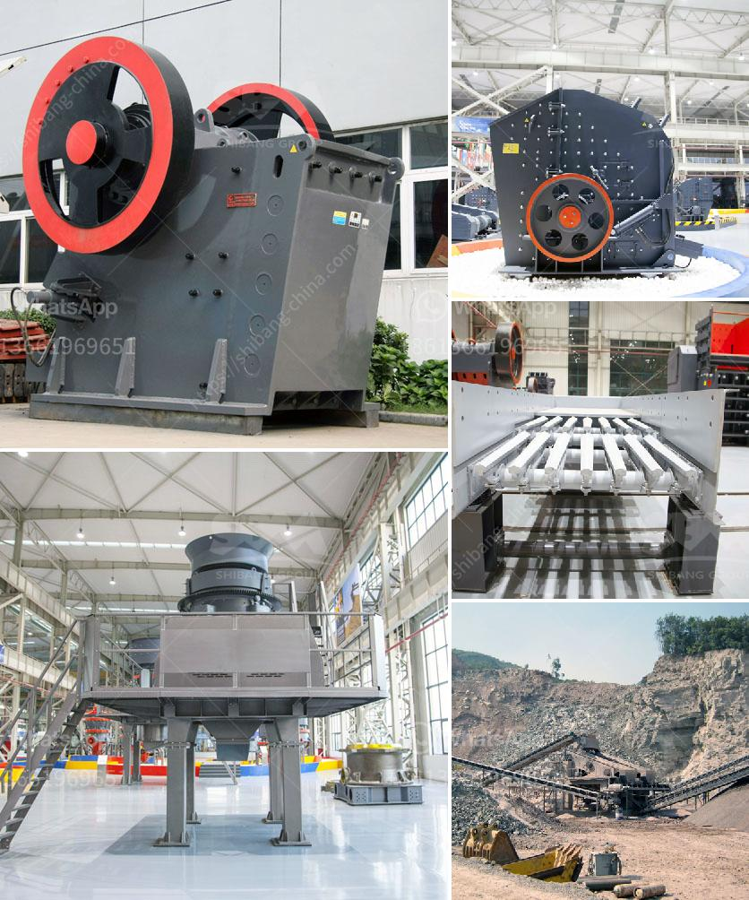

<h3>clay working clay powder making machine</h3>
Clay working has been a traditional art form for centuries, with people using this versatile material to create beautiful pottery, sculptures, and various crafts. However, one of the crucial steps in the clay working process is preparing clay powder – a fine, consistent, and moldable substance that allows artists to shape their art with precision and ease. This is where a clay powder making machine comes into play.

A clay powder making machine is a specialized tool that grinds raw clay into a fine powder, making it easier to work with and manipulate. These machines are invaluable for potters, sculptors, and artists who work with clay consistently. They save time and effort by eliminating the need for manual grinding and sieving, producing consistent results every time.

The machine typically consists of a rotating drum or container where the clay pieces are placed. Inside the container, there are grinding balls or rods that help break down the clay into a fine powder. The grinding action is driven by an electric motor, providing the necessary force and speed to achieve the desired consistency.

Many clay powder making machines also come with sieves or filters that separate any impurities from the powdered clay, ensuring a pure and refined product. This is especially important for artists who require clay of specific qualities, such as white or low-porosity.

The versatility of clay powder making machines allows artists to experiment and explore various techniques. The finely ground clay powder can be mixed with water or other additives to create different clay consistencies, such as slip or slurry, for casting or sculpting purposes. Artists can also mix different clay types to achieve unique properties in their artwork.

In conclusion, a clay powder making machine is an essential tool for artists who work with clay regularly. It simplifies the clay preparation process, making it more efficient and consistent. With its ability to produce a fine and moldable powder, artists can unleash their creativity and bring their clay creations to life with ease.
<h3>Contact us</h3><ul><li><strong>Whatsapp:&nbsp;<a href="https://wa.me/8613661969651">+8613661969651</a></strong></li><li><a href="https://swt.shibang-china.com/?git&amp;zhl&amp;clay working clay powder making machine"><strong>Online Service(chat now)</strong></a></li></ul><h3>Related</h3><ul><li><a href='limestone crushing processing for the manufacture.md'>limestone crushing processing for the manufacture</a></li><li><a href='stone crushing machine factories in shanghai.md'>stone crushing machine factories in shanghai</a></li><li><a href='dolomite crusher manufacturer in usa.md'>dolomite crusher manufacturer in usa</a></li><li><a href='crusher processing machines nigeria.md'>crusher processing machines nigeria</a></li><li><a href='conveyor belt design manual pdf.md'>conveyor belt design manual pdf</a></li></ul>