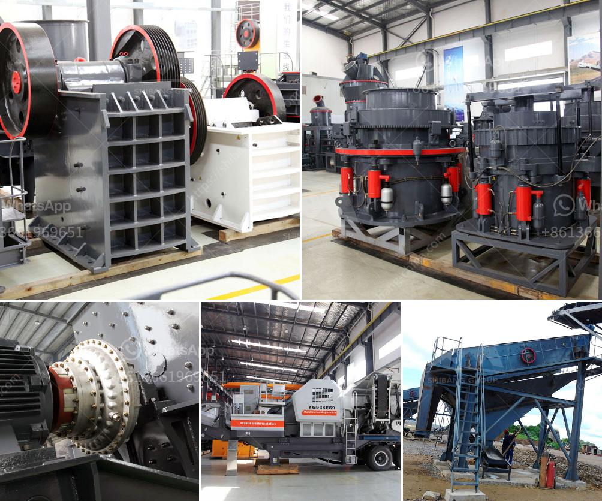

<h3>clinker processing line in germany</h3>
Germany is renowned for its advanced technology and well-established industrial sector. Among its many industries, the cement manufacturing industry is considered one of the strongest pillars of the country's economy. Germany has several state-of-the-art clinker processing lines, which are responsible for producing a significant portion of the world's cement.

Clinker processing lines are specialized facilities that convert raw materials, primarily limestone and clay, into clinker, a crucial ingredient in cement production. This process involves intense heat treatment, where the raw materials are heated at high temperatures to produce a partially fused material called clinker. The clinker is then pulverized and mixed with gypsum and other additives to produce cement.

Germany's clinker processing lines are known for their efficiency, advanced technology, and commitment to sustainability. These facilities incorporate a range of innovative techniques to optimize the manufacturing process and reduce environmental impact.

One such technique implemented by many clinker processing lines in Germany is the use of alternative fuels. These facilities have adopted the concept of co-processing, where non-recyclable waste materials such as plastics, tires, and agricultural residues are used as fuel in the clinker kilns. This not only solves the problem of waste disposal but also reduces the reliance on traditional fossil fuels, thus minimizing carbon emissions.

In addition to alternative fuels, clinker processing lines in Germany have also embraced energy-efficient technologies. The use of preheaters and pre-calciners helps to recover and utilize waste heat from the kilns, resulting in significant energy savings. Furthermore, modern automated systems, such as advanced control systems and artificial intelligence applications, ensure precise control over the manufacturing process, reducing operational costs and enhancing productivity.

The commitment to sustainability is also evident in the waste management practices of these clinker processing lines. Germany has stringent regulations for waste management, including strict monitoring of emissions and strict requirements for hazardous waste disposal. By adhering to these regulations, the industry ensures the protection of the environment and the health and safety of its workers and neighboring communities.

Moreover, Germany's clinker processing lines are constantly investing in research and development to improve their operations. Collaborations with universities and research institutes enable the industry to stay at the forefront of technological advancements. This continuous innovation ensures the production of high-quality clinker while minimizing environmental impact.

Germany's clinker processing lines play a crucial role in the global cement industry. The country is known for its high standards of manufacturing, efficiency, and commitment to sustainability. These factors have made German clinker highly sought after in international markets.

In conclusion, Germany's clinker processing lines have set the benchmark for sustainable and efficient cement production. Through the use of alternative fuels, energy-efficient technologies, and strict waste management practices, these facilities exemplify the country's commitment to environmental protection. As the cement industry continues to grow, Germany's clinker processing lines will undoubtedly remain at the forefront of cement manufacturing, contributing significantly to the country's economy and sustainability goals.
<h3>Contact us</h3><ul><li><strong>Whatsapp:&nbsp;<a href="https://wa.me/8613661969651">+8613661969651</a></strong></li><li><a href="https://swt.shibang-china.com/?git&amp;zhl&amp;clinker processing line in germany"><strong>Online Service(chat now)</strong></a></li></ul><h3>Related</h3><ul><li><a href='crushers for sale south africa.md'>crushers for sale south africa</a></li><li><a href='cobble stone machine nigeria.md'>cobble stone machine nigeria</a></li><li><a href='crushing construction waste crusher.md'>crushing construction waste crusher</a></li><li><a href='jaw crusher for sale south africa.md'>jaw crusher for sale south africa</a></li><li><a href='iron ore processing equipment cost.md'>iron ore processing equipment cost</a></li></ul>