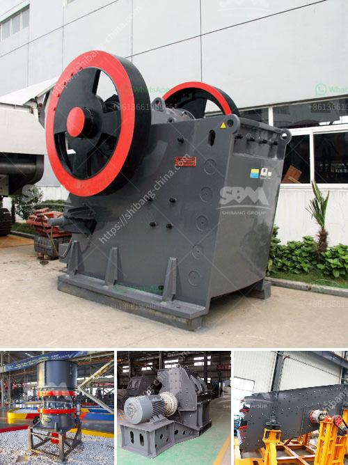

<h3>clinker roller crusher manufacturers</h3>
Clinker roller crusher is a new type of crusher equipment designed and developed on the basis of hammer crusher, plate hammer crusher and other crushers. It integrates mechanical, hydraulic and other technologies. It adopts a new type of single motor, two crushing rollers, small swing angle, large size reduction ratio, low energy consumption, and uniform discharge particle size. It is an ideal equipment for crushing clinker in large cement plants.

As the leading clinker roller crusher manufacturer in China, we provide quality and efficient clinker roller crusher machines for cement production line. Our company focuses on the research and development, production and sales of clinker roller crusher. It adopts advanced technology and mature production technology to ensure the quality and performance of the equipment.

Our clinker roller crusher has a unique structure design, which can effectively crush clinker without blocking the screen. The equipment is equipped with two crushing rollers, which can rotate in opposite directions. The clinker is evenly crushed by the roller, pressed and ground, and the product has good granular shape, low powder rate, and low energy consumption.

With many years of experience in the industry, our clinker roller crusher has been well received by customers both domestically and internationally. It has been widely used in cement production lines of large and medium-sized cement plants, and has received praise for its excellent performance, stable operation, and low maintenance cost.

In addition to the clinker roller crusher, we also provide other types of crushers, such as jaw crusher, impact crusher, cone crusher, hammer crusher, etc., each with its own unique advantages. We provide a complete set of solutions for cement production, with reliable quality and affordable price.

In conclusion, as a professional clinker roller crusher manufacturer, we are committed to providing customers with high-quality equipment and comprehensive after-sales service. We strive to meet the diverse needs of customers and contribute to the development of the cement industry. Customers are welcome to visit our factory and cooperate with us for mutual benefit.
<h3>Contact us</h3><ul><li><strong>Whatsapp:&nbsp;<a href="https://wa.me/8613661969651">+8613661969651</a></strong></li><li><a href="https://swt.shibang-china.com/?git&amp;zhl&amp;clinker roller crusher manufacturers"><strong>Online Service(chat now)</strong></a></li></ul><h3>Related</h3><ul><li><a href='rock stone crushing machine in usa.md'>rock stone crushing machine in usa</a></li><li><a href='cec rock crushers for sale.md'>cec rock crushers for sale</a></li><li><a href='coal mining equipment manufacturers in south africa.md'>coal mining equipment manufacturers in south africa</a></li><li><a href='vertical shaft impact crusher.md'>vertical shaft impact crusher</a></li><li><a href='stone crusher plant 80 ton.md'>stone crusher plant 80 ton</a></li></ul>