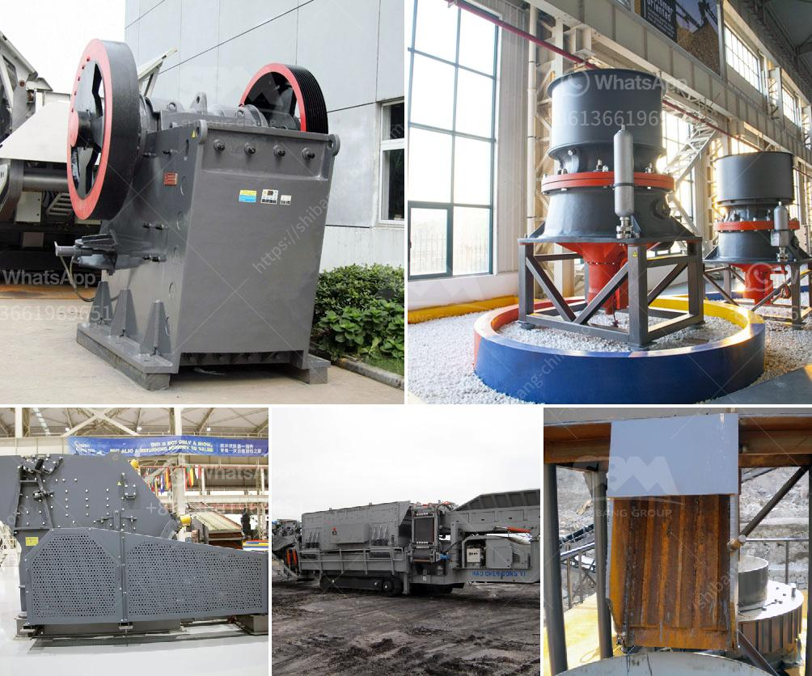

<h3>coal conveyor manufacturer germany</h3>
Germany has been at the forefront of implementing sustainable energy strategies, gradually reducing its reliance on coal-fired power plants. However, the country still heavily relies on coal as a source of energy. For this reason, coal conveyor systems play a crucial role in ensuring the smooth transportation and handling of coal within power plants and industrial facilities. As a result, Germany boasts some of the world's leading coal conveyor manufacturers, known for their innovative technology and high-quality equipment.

One prominent coal conveyor manufacturer in Germany is FAM Förderanlagen Magdeburg. Founded in 1851, the company has a long history of engineering excellence and manufacturing expertise. FAM offers a range of conveyor solutions specifically tailored to the requirements of coal handling, including belt conveyors, chain conveyors, and screw conveyors. With their cutting-edge technology and precision engineering, FAM's conveyor systems provide efficient and reliable coal transportation, minimizing downtime and optimizing the overall operational efficiency of power plants.

Another renowned name in the industry is Beumer Group. With over 80 years of experience, Beumer is a global leader in material handling, offering innovative and fully automated solutions for various industries, including coal mining and power generation. Beumer's conveyor systems are designed to handle the demanding conditions of coal transport, ensuring smooth movement while minimizing dust emissions. Their conveyor belts are equipped with advanced technology, such as energy-efficient drives and automated monitoring systems, guaranteeing high-performance and cost-effective operations.

SCHADE Lagertechnik is yet another prominent German manufacturer specializing in coal handling systems. Established in 1872, SCHADE Lagertechnik has developed a strong reputation for its high-quality and reliable equipment. The company provides a comprehensive range of conveyor solutions, such as stacker/reclaimers and combined stacker/reclaimers, which are crucial components in coal stockyard management. SCHADE's products are known for their robust construction and efficient material handling, ensuring the safe and effective movement of coal within storage facilities.

Germany's commitment to environmental sustainability has also influenced the coal conveyor industry, driving the development of eco-friendly technologies. Many German manufacturers prioritize energy efficiency and have implemented measures to minimize the environmental impact of their equipment. By utilizing advanced drive systems, optimized belt designs, and efficient dust control mechanisms, these manufacturers contribute to reducing energy consumption and lowering carbon emissions associated with coal transportation.

Furthermore, German coal conveyor manufacturers have recognized the importance of digitalization and automation in improving the efficiency and safety of coal handling. By utilizing smart sensor technologies, data analytics, and remote monitoring systems, these manufacturers offer state-of-the-art conveyor solutions that enhance overall plant productivity and reduce maintenance costs. Such innovations enable real-time monitoring of conveyor performance, early detection of potential issues, and predictive maintenance, ensuring uninterrupted coal transport operations.

In conclusion, Germany's coal conveyor manufacturers are at the forefront of meeting the demands of the coal industry by providing reliable, efficient, and environmentally friendly conveyor systems. Through their technological advancements, these manufacturers contribute to the sustainable and efficient use of coal as an energy source. With their strong commitment to quality, innovation, and safety, German manufacturers are trusted partners for power plants and industrial facilities worldwide, ensuring the smooth movement of coal and supporting the energy transition towards a cleaner future.
<h3>Contact us</h3><ul><li><strong>Whatsapp:&nbsp;<a href="https://wa.me/8613661969651">+8613661969651</a></strong></li><li><a href="https://swt.shibang-china.com/?git&amp;zhl&amp;coal conveyor manufacturer germany"><strong>Online Service(chat now)</strong></a></li></ul><h3>Related</h3><ul><li><a href='vertical ultra fine pulverizer.md'>vertical ultra fine pulverizer</a></li><li><a href='small scale gold mining in kadoma zimbabwe.md'>small scale gold mining in kadoma zimbabwe</a></li><li><a href='top 10 stone crusher companies in india.md'>top 10 stone crusher companies in india</a></li><li><a href='continuous ball mill manufactures in gujrat.md'>continuous ball mill manufactures in gujrat</a></li><li><a href='cement vertical roller mill price in india.md'>cement vertical roller mill price in india</a></li></ul>