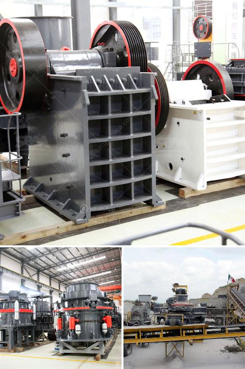

<h3>coal crusher machine prices in india</h3>
India is a country rich in coal resources. Coal reserves are estimated to be around 300 billion tons, making it one of the largest producers of coal globally. In recent years, India has emerged as a major global producer of coal, contributing significantly to the energy generation sector. To extract and utilize coal efficiently, it is essential to have proper coal crushing equipment in place.

Coal crusher machines are designed to reduce the coal particles into a fine powder or granulate for combustion purposes. It is a common piece of equipment in coal handling plants and coke ovens. The crushing principle of coal crusher machines is the application of force from two rotors with toothed blades, which crushes the large coal blocks into smaller pieces. By using different types of crushers, such as jaw crushers, impact crushers, cone crushers, and hammer crushers, coal can be processed and crushed into different sizes.

The prices of coal crusher machines vary significantly depending on the type of machine, brand, and size. To make an accurate estimate, we must consider the manufacturer's reputation, after-sales services, and machine quality. However, one thing is clear - the prices of coal crusher machines are generally competitive on the market. Currently, there are various models of coal crusher machines available in India.

One of the most popular models is the PE-250×400 jaw crusher machine. This type of crusher is widely used in mining, chemical, and cement industries for crushing various materials with compressive strength not exceeding 320 MPa. It has a simple structure, reliable operation, and low operating costs. The price of this jaw crusher machine generally ranges from around Rs. 80,000 to Rs. 10 lakh.

Another commonly used coal crusher machine is the impact crusher. The impact crusher is versatile and can be used in both primary and secondary crushing applications. It crushes the material by impact with the help of high-speed rotating hammers. The price of an impact crusher machine varies from around Rs. 1 lakh to Rs. 5 lakh.

In addition to jaw crushers and impact crushers, cone crushers are also commonly used in coal crushing applications. Cone crushers are suitable for crushing various minerals and rocks with medium hardness or above. They have the advantages of reliable structure, high production efficiency, and easy adjustment of the discharging opening. The price of a cone crusher machine ranges from around Rs. 50,000 to Rs. 1 crore.

It is important to note that the prices mentioned here are approximate values and can vary based on market conditions, machine capacity, and other factors. Furthermore, these prices are indicative and may not include taxes, transportation, and installation costs.

In conclusion, coal crusher machines play a crucial role in the coal mining and processing industry in India. The prices of these machines vary based on factors such as machine type, brand, and size. It is essential for buyers to evaluate their specific requirements and budget before making a purchase. By choosing the right coal crusher machine, individuals and industries can effectively process coal and contribute to efficient energy generation.
<h3>Contact us</h3><ul><li><strong>Whatsapp:&nbsp;<a href="https://wa.me/8613661969651">+8613661969651</a></strong></li><li><a href="https://swt.shibang-china.com/?git&amp;zhl&amp;coal crusher machine prices in india"><strong>Online Service(chat now)</strong></a></li></ul><h3>Related</h3><ul><li><a href='jaw crusher price capacity.md'>jaw crusher price capacity</a></li><li><a href='marble powder 100 mesh grinding machine.md'>marble powder 100 mesh grinding machine</a></li><li><a href='cement production procedure in vertical mill.md'>cement production procedure in vertical mill</a></li><li><a href='jaw crusher machine in dubai.md'>jaw crusher machine in dubai</a></li><li><a href='pulverizer for ultra fine grinding mill.md'>pulverizer for ultra fine grinding mill</a></li></ul>