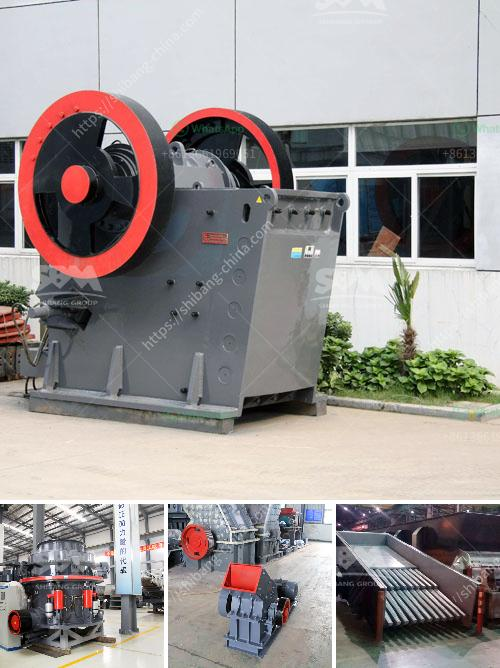

<h3>coal crusher machine</h3>
Coal crusher machine is a machine crushing coal which is unprocessed after being extracted from mine. Coal crusher machine is a type of crusher that is utilized in coal mining industry. Coal crusher is a specification in which there is a requirement of minimum size of coal particles and maximum diameter of the crusher discharge. The machine reduces coal size from 1m to 20mm which is very helpful for coal handling and subsequent processing. However, it’s not only limited to coal mining industry, as the machine can be used for crushing of other minerals like limestone, gypsum, etc. The flexibility of the machine is something that goes hand in hand with its usefulness.

The machine's main features include high productivity, low maintenance costs, easy operation, and mining throughput capacity. It’s important to mention that its feeding size is up to 600mm with a crushing capacity of up to 4000t/h. Furthermore, this heavy-duty machine is capable of handling rocks with hardness ranging from medium-hard to extremely hard.

In conclusion, the coal crusher machine has the features of big crushing ratio and low noise. It can be widely used in coal processing field, building material field, and chemical industry. With the development of technology, the machine has also been updated to meet the modern needs. We provide different types and models of coal crusher machine, so choose the most suitable one for your coal crushing needs.
<h3>Contact us</h3><ul><li><strong>Whatsapp:&nbsp;<a href="https://wa.me/8613661969651">+8613661969651</a></strong></li><li><a href="https://swt.shibang-china.com/?git&amp;zhl&amp;coal crusher machine"><strong>Online Service(chat now)</strong></a></li></ul><h3>Related</h3><ul><li><a href='cone crusher instructions.md'>cone crusher instructions</a></li><li><a href='cement vertical roller mill price in india.md'>cement vertical roller mill price in india</a></li><li><a href='stone crusher plant 80 ton.md'>stone crusher plant 80 ton</a></li><li><a href='3tph ball mill for gold ore processing.md'>3tph ball mill for gold ore processing</a></li><li><a href='used stone crasher machine for sale.md'>used stone crasher machine for sale</a></li></ul>