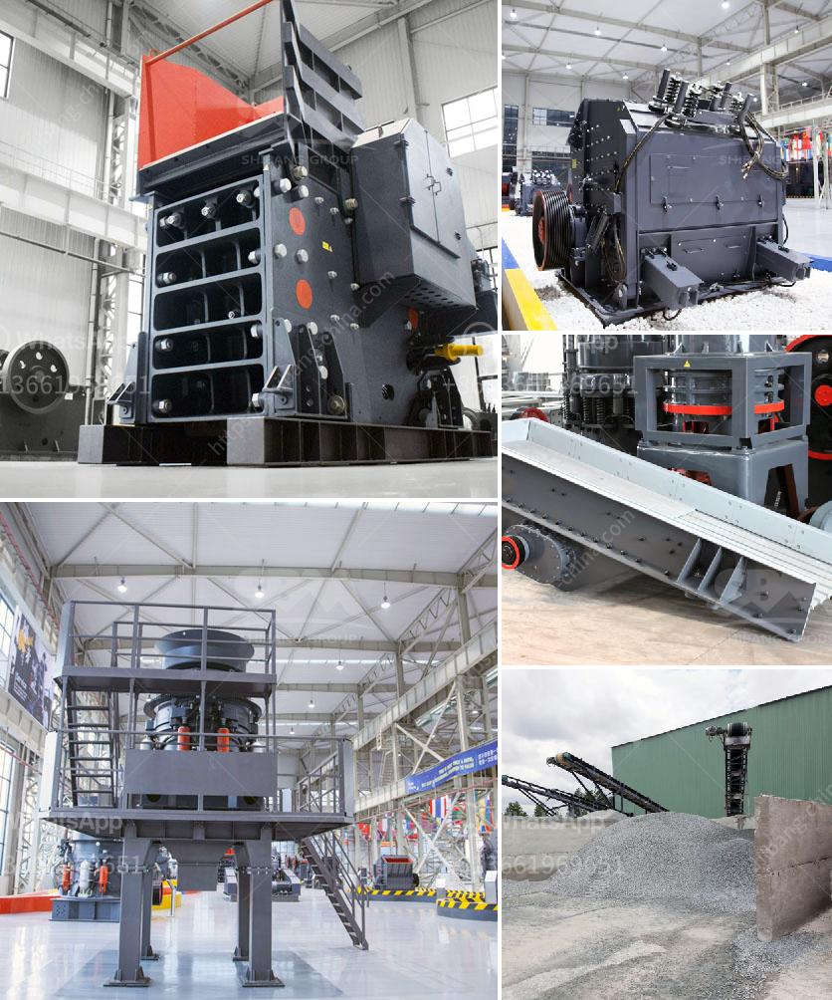

<h3>coal crusher types</h3>
Coal, a solid mineral extracted from the earth, is an essential source of energy. As the world continues to develop and urbanize, the demand for coal only seems to increase. However, coal in its raw form cannot be used directly for various industries, such as power plants or steel production. To harness its energy potential effectively, coal needs to be processed and crushed into different sizes. This is where coal crusher types come into play.

There are several types of coal crushers available in the market. Jaw crusher, which is used for coarse crushing, applies force to the coal to compress it against the fixed jaw plate, exerting great pressure. This is crucial in making it dense. Cone crusher, on the other hand, is used to crush softer materials like limestone. These aggregates are also compressed against a stationary surface, ensuring a finer and more consistent result.

Roll crushers are primarily used in coal mining applications, where the fines produced during crushing are undesirable. This specially designed machine can help to achieve a specific product size, thus allowing for more control and higher yield during the processing phase.

Another type of coal crusher is the impact crusher. Unlike a jaw crusher, which uses pressure to crush material, this machine uses the force of impact. With massive rotating hammers attached to a spinning rotor, the material is steadily pulverized into smaller pieces. This type of crusher is commonly used in coal handling plants and cement industries.

Additionally, the hammer mill crusher is popular due to its flexibility, versatility, and efficiency. It works on the principle of impact and attrition, reducing the coal materials into smaller sizes by the repeated blows of little hammers.

In conclusion, coal crushers are indispensable in the coal mining industry, where the material needs to be crushed into specific sizes for efficient energy extraction. Different types of crushers serve different purposes, ensuring the coal is processed correctly to meet the demands of various industries.
<h3>Contact us</h3><ul><li><strong>Whatsapp:&nbsp;<a href="https://wa.me/8613661969651">+8613661969651</a></strong></li><li><a href="https://swt.shibang-china.com/?git&amp;zhl&amp;coal crusher types"><strong>Online Service(chat now)</strong></a></li></ul><h3>Related</h3><ul><li><a href='cement production machinery.md'>cement production machinery</a></li><li><a href='rotary kiln manufacturers in australia.md'>rotary kiln manufacturers in australia</a></li><li><a href='small ball mill for sale in india.md'>small ball mill for sale in india</a></li><li><a href='quarry equipment in kenya.md'>quarry equipment in kenya</a></li><li><a href='ball mill for aluminum powder.md'>ball mill for aluminum powder</a></li></ul>