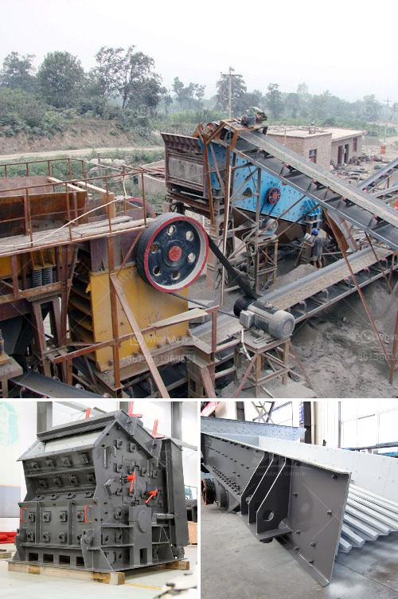

<h3>coal crushing and washing plant for sale south africa</h3>
Coal, a fossil fuel derived from ancient forests, is one of the primary fuels powering industrial development across the globe. With ample reserves found in various parts of the world, coal continues to play a significant role in meeting energy demands.

In South Africa, coal mining and the coal-fired power generation industry contribute significantly to the country’s economic growth. However, the environmental impacts associated with coal extraction and utilization cannot be overlooked. As the world transitions towards cleaner and more sustainable energy sources, the coal industry faces numerous challenges.

One such obstacle is the need to improve coal quality to meet stricter emission regulations. Raw coal, straight from the mines, often contains impurities such as rock, clay, and other minerals that need to be removed before it can be used effectively. This process, known as coal washing or coal beneficiation, involves crushing the coal and utilizing water and mechanical techniques to separate the coal from impurities and contaminants.

At first glance, owning a coal washing and crushing plant may seem like a throwback to the industrial revolution, but in reality, it is an investment opportunity that can reap long term benefits for the growing South African economy. South Africa has vast coal reserves and is ranked as the sixth-largest coal producer in the world. This presents an ideal opportunity for investors to set up coal washing plants in the region.

Coal washing plants, also known as coal preparation plants or coal handling plants, remove impurities from raw coal before it is shipped to market. The clean coal is then sold to power plants, steel manufacturers, and other industrial sectors, helping to reduce greenhouse gas emissions and improve air quality.

There are various types of coal washing plants available depending on the specific needs of the coal. Dense medium separation (DMS) plants use a dense medium, typically a suspension of finely ground magnetite or ferrosilicon, to separate coal from impurities. Jigging plants employ pulsating water and gravity to separate the coal and impurities based on their density differences. Spirals plants use gravity and centrifugal forces to separate the coal from impurities.

One of the key benefits of coal washing and crushing plants is their ability to improve the quality and consistency of coal products. In doing so, this reduces transportation costs and allows for higher selling prices in the market. Additionally, by removing impurities, the coal becomes more efficient to burn, resulting in reduced emissions and a smaller environmental footprint.

Investing in coal crushing and washing plants in South Africa offers a strategic advantage for investors and the country alike. Long term advancements in sustainable coal technologies, such as carbon capture and utilization, are currently being developed. By investing in coal washing plants now, investors can ensure they are well-positioned to adapt to future energy demands while minimizing environmental impacts.

In conclusion, coal washing and crushing plants provide a viable investment opportunity in South Africa. With increasing emphasis on reducing our reliance on coal and transitioning to cleaner energy sources, capitalizing on the country’s vast coal reserves through coal washing plants can be a sustainable and profitable venture. It presents an opportunity to improve coal quality, reduce emissions, and contribute to the country’s economic growth in an environmentally responsible manner.
<h3>Contact us</h3><ul><li><strong>Whatsapp:&nbsp;<a href="https://wa.me/8613661969651">+8613661969651</a></strong></li><li><a href="https://swt.shibang-china.com/?git&amp;zhl&amp;coal crushing and washing plant for sale south africa"><strong>Online Service(chat now)</strong></a></li></ul><h3>Related</h3><ul><li><a href='calcium carbonate powder processing plant.md'>calcium carbonate powder processing plant</a></li><li><a href='coal conveyor manufacturer germany.md'>coal conveyor manufacturer germany</a></li><li><a href='used small gold processing plant from dubai.md'>used small gold processing plant from dubai</a></li><li><a href='stone crusher machine spintex accra.md'>stone crusher machine spintex accra</a></li><li><a href='kaolin mill machine 400 mesh.md'>kaolin mill machine 400 mesh</a></li></ul>