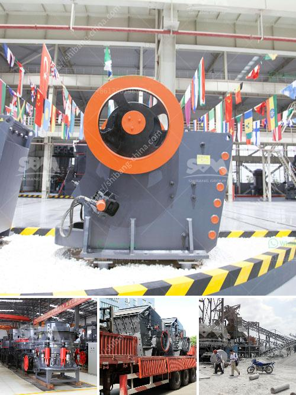

<h3>coal grinding machine</h3>
Coal is a combustible black or brownish-black sedimentary rock that is primarily composed of carbon, along with various other elements such as hydrogen, sulfur, oxygen, and nitrogen. It is one of the most widely used fossil fuels, providing a significant source of energy worldwide. To utilize coal efficiently, it needs to be pulverized into fine particles through coal grinding machines.

A coal grinding machine is a vital piece of equipment for the thermal power plants that utilize coal as a fuel source. The coal grinding machine is primarily used for processing fine particles of materials in industries such as metallurgy, chemical engineering, and electric power. It can crush, dry, grind, and classify materials, making it an extremely versatile machine.

One of the key advantages of using a coal grinding machine is its ability to produce a fine and uniform granular product. This is crucial for efficient combustion in power plants. By finely grinding the coal, it increases the surface area, allowing for better combustion and heat release. Additionally, grinding the coal ensures that all particles are of the same size, which leads to a more consistent and reliable combustion process.

Another advantage of utilizing a coal grinding machine is its ability to reduce the moisture content of the coal. This is achieved by using hot air to dry the coal during the grinding process. By reducing the moisture content, the heating value of the coal is increased, resulting in improved efficiency and reduced emissions.

Furthermore, a coal grinding machine can also increase the overall efficiency of coal-fired power plants. By grinding the coal before it is burned, it eliminates lumps and impurities, ensuring a more efficient and complete combustion process. This leads to higher power generation efficiency and lower emissions of harmful pollutants such as sulfur dioxide and nitrogen oxide.

In conclusion, a coal grinding machine is a valuable piece of equipment for thermal power plants that rely on coal as a fuel source. It is capable of pulverizing coal into fine particles, which enhances the combustion process and improves overall efficiency. By reducing the moisture content and eliminating impurities, it ensures cleaner emissions and a more sustainable energy source.
<h3>Contact us</h3><ul><li><strong>Whatsapp:&nbsp;<a href="https://wa.me/8613661969651">+8613661969651</a></strong></li><li><a href="https://swt.shibang-china.com/?git&amp;zhl&amp;coal grinding machine"><strong>Online Service(chat now)</strong></a></li></ul><h3>Related</h3><ul><li><a href='wet and dry ball mill.md'>wet and dry ball mill</a></li><li><a href='dry grinding ball mill.md'>dry grinding ball mill</a></li><li><a href='crushing machine manufacturers cape town.md'>crushing machine manufacturers cape town</a></li><li><a href='coal crusher machine prices in india.md'>coal crusher machine prices in india</a></li><li><a href='rock stone crushing machine in usa.md'>rock stone crushing machine in usa</a></li></ul>