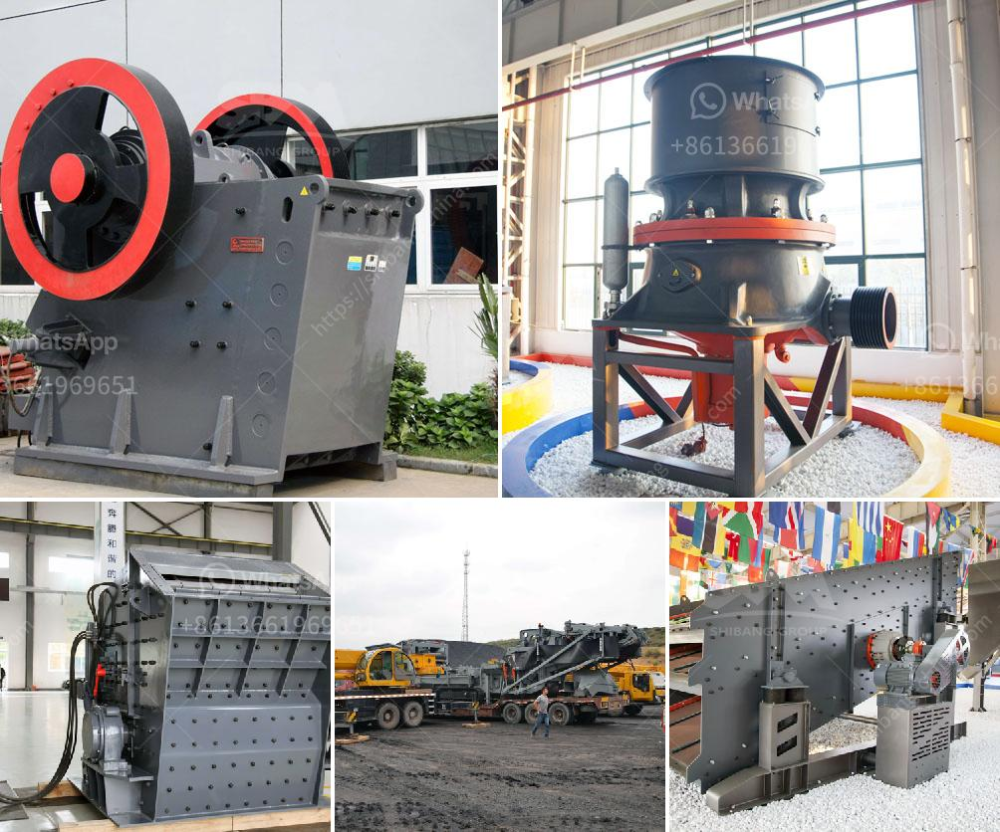

<h3>coal machines for sale in south africa</h3>
Coal is a prominent fuel in South Africa and the country relies heavily on coal mining and utilization as a source of economic growth and energy. However, the coal industry in South Africa faces significant challenges including environmental degradation and declining reserves. To address these concerns and sustain the industry's growth, the use of advanced coal machines has become crucial.

The mining sector in South Africa plays a pivotal role in the country's economy, contributing significantly to job creation and revenue generation for both the government and local communities. Coal mining, in particular, has been a major contributor to the energy sector, providing the primary fuel source for power generation.

To keep up with the growing demands of the coal industry, the need for advanced coal machines has become apparent. These machines not only improve the efficiency and productivity of mining operations but also have a positive impact on the environment. Modern coal machines reduce the reliance on manual labor, making mining safer and more efficient.

One of the key advancements in coal machines is the development of automated systems that can perform various tasks, including drilling, cutting, and loading of coal. These machines are equipped with advanced sensors and intelligent control systems that optimize the extraction process, reducing the risk of accidents and increasing productivity. Automation also leads to cost reductions, as fewer workers are required and less equipment downtime occurs.

In addition to automation, eco-friendly coal machines have gained importance in South Africa. Due to concerns about environmental degradation caused by coal mining, there is an increasing demand for machines that can minimize the impact on ecosystems and reduce greenhouse gas emissions. Many coal machines now incorporate technologies such as dust control systems and emission reduction devices, ensuring a cleaner and safer working environment.

As the demand for advanced coal machines continues to rise in South Africa, the market for these machines has expanded. Various companies specialize in manufacturing and selling state-of-the-art coal machines that cater to individual mining requirements. These machines are designed to operate in harsh mining conditions and are capable of withstanding high temperatures and dust levels.

Additionally, there is a growing trend of leasing coal machines in South Africa. This allows smaller mining companies to access modern and efficient equipment without incurring the high initial costs of purchasing them outright. Leasing options also provide flexibility, enabling mining companies to adapt their equipment as mining operations evolve.

In conclusion, the coal industry in South Africa faces numerous challenges, including environmental concerns and declining reserves. To sustain the industry's growth, the use of advanced coal machines is vital. These machines not only improve efficiency and productivity but also address environmental concerns by incorporating eco-friendly technologies. With the increasing market demand, various companies offer coal machines for sale in South Africa, providing mining operators with access to modern equipment. Additionally, leasing options enable smaller mining companies to benefit from advanced coal machines without the hefty upfront costs. With the right machinery in place, the coal industry in South Africa can continue to contribute to the country's economic growth while minimizing its environmental impact.
<h3>Contact us</h3><ul><li><strong>Whatsapp:&nbsp;<a href="https://wa.me/8613661969651">+8613661969651</a></strong></li><li><a href="https://swt.shibang-china.com/?git&amp;zhl&amp;coal machines for sale in south africa"><strong>Online Service(chat now)</strong></a></li></ul><h3>Related</h3><ul><li><a href='talc powder plant.md'>talc powder plant</a></li><li><a href='rock crusher plans.md'>rock crusher plans</a></li><li><a href='impact crushers for sale in usa.md'>impact crushers for sale in usa</a></li><li><a href='calcium carbonate powder processing plant.md'>calcium carbonate powder processing plant</a></li><li><a href='cost of concrete batch plant.md'>cost of concrete batch plant</a></li></ul>