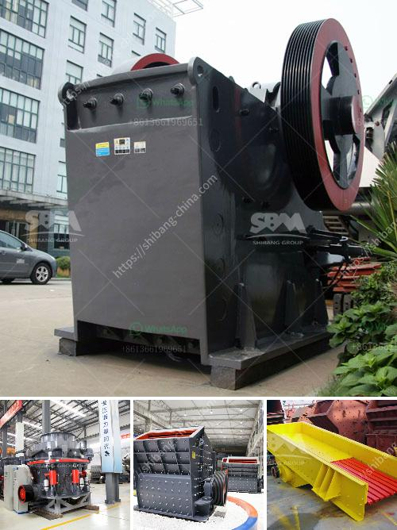

<h3>coal mill in malaysia</h3>
Coal is one of the primary sources of energy in Malaysia, accounting for 41% of the country's total primary energy consumption. As of 2020, Malaysia has more than 3.7 billion metric tonnes of coal reserves, making it a significant player in the global coal industry.

The coal mill, also known as a pulverizer, plays a crucial role in the coal-fired power generation process. Coal-fired power plants in Malaysia rely heavily on coal mills to pulverize coal before it can be burned for energy. In Malaysia, coal-fired power plants are the main source of electricity generation, supplying about 50% of the country's electricity needs.

A coal mill consists of a rotating cylinder with grinding balls inside it. When the coal is fed into the cylinder, it is crushed and ground by the grinding balls. The coal particles are then blown into a high-velocity air stream, which carries them to a classifier where they are separated based on size. The larger coal particles are returned to the mill for further grinding, while the finer particles are carried out of the mill and burned in the power plant's boiler.

The efficiency of a coal mill is crucial for the overall efficiency of a coal-fired power plant. A poorly designed or malfunctioning coal mill can lead to reduced power output and increased greenhouse gas emissions. Therefore, maintaining and optimizing coal mills is essential for ensuring the smooth operation of a power plant.

One of the challenges faced by coal mills in Malaysia is the high moisture content of the coal. Malaysia's coal typically has a moisture content ranging from 35% to 40%, which can cause the coal to stick to the mill's internals, reducing its grinding capacity. To overcome this challenge, coal mills in Malaysia are equipped with additional heat sources such as hot air generators to dry the coal before it is fed into the mill.

Another challenge faced by coal mills in Malaysia is the abrasive nature of the coal. The high ash content of Malaysian coal can cause accelerated wear and tear on the grinding elements of the mill, leading to reduced grinding efficiency and increased maintenance costs. To mitigate this issue, coal mills are often lined with abrasion-resistant materials to prolong their lifespan and improve grinding performance.

Despite these challenges, coal mills in Malaysia have been able to adapt and remain a reliable and cost-effective method of producing electricity. Furthermore, efforts are being made to reduce the country's dependency on coal and transition to cleaner and more sustainable energy sources. The Malaysian government has set a target to increase the share of renewable energy in the country's energy mix to 20% by 2025.

In conclusion, coal mills play a crucial role in Malaysia's coal-fired power generation process. They are responsible for crushing and grinding coal into fine particles, which are then burned to produce electricity. Despite the challenges posed by high moisture and abrasive coal, coal mills in Malaysia have been able to maintain their efficiency and reliability. However, efforts to transition to cleaner energy sources are underway to reduce the country's dependency on coal.
<h3>Contact us</h3><ul><li><strong>Whatsapp:&nbsp;<a href="https://wa.me/8613661969651">+8613661969651</a></strong></li><li><a href="https://swt.shibang-china.com/?git&amp;zhl&amp;coal mill in malaysia"><strong>Online Service(chat now)</strong></a></li></ul><h3>Related</h3><ul><li><a href='stone crusher mobile crusher layout.md'>stone crusher mobile crusher layout</a></li><li><a href='quartz ball mills hyderabad.md'>quartz ball mills hyderabad</a></li><li><a href='small scale stone crusher for sale zimbabwe.md'>small scale stone crusher for sale zimbabwe</a></li><li><a href='setting up limestone processing plant in nigeria.md'>setting up limestone processing plant in nigeria</a></li><li><a href='conical ball mill manufacturers in india.md'>conical ball mill manufacturers in india</a></li></ul>