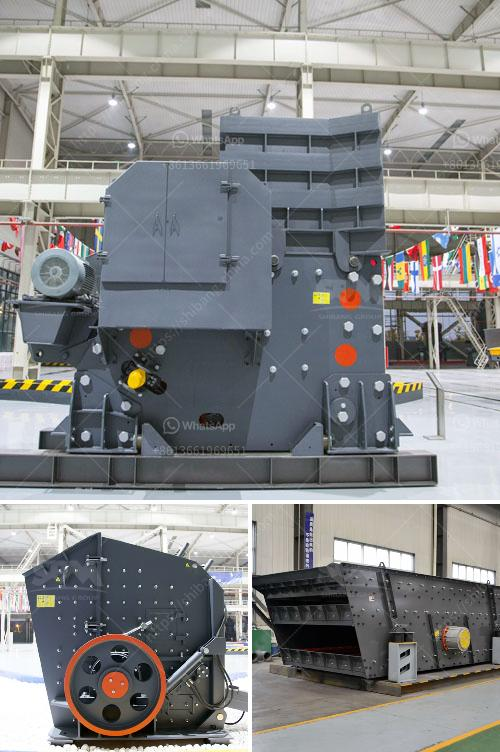

<h3>coal mill of cement plant</h3>
Coal mill is the vital equipment in the thermal power plant and cement plant. Coal mill is used to grind, pulverize and dry coal before the coal is transmitted the boiler. The coal is feed into the coal mill via a inlet pipe so that the roller coal mill such as ball mill or vertical mill can pulverize the coal into particles. However, different degrades of coal are used in different application with different requirements.

To satisfy the diverse needs of the clients, our company delivers the high quality coal mill vertical mill for cement producers. The coal mill of our company has the following unique advantages:

The structure of the coal vertical mill is simple and the operation is steady when used and with a drying capacity of large, it is easy to adjust the fineness of the coal powder and improve the output. The high-quality coal mill produced by our company can meet the specific requirements of different clients.

The grinding coal powder has a wide range of applications in many industries, such as power plant, boiler, combustion enterprise, steel rolling, and glass production, so it is widely used in cement plant mills. The coal mill is the most important auxiliary equipment for coal-powder furnace. It has three methods to crush the coal lump and grind them into powder, it is crushing, impacting and grinding.

Coal mills manufactured by our company have the best quality and the most competitive price, and have been exported to more than 120 countries, such as India, Vietnam, Indonesia, USA, Colombia, Mexico, Bolivia, Brazil, Peru, and so on. Our pulverized coal preparation production line is composed of Raw Coal Storage & Transportation System, Grinding System, Dust Collecting System, Electrical & Instrument Automation System.

The wearing parts of our company's equipment are made of high-quality wear-resistant materials, which have strong wear resistance and long service life.

In conclusion, the coal mill of a cement plant is a complex and delicate work condition that requires supreme attention and precision. To ensure quality and longevity of the coal mill, it is necessary to use high-quality coal mills to construct and maintain the coal mill of a cement plant. Moreover, the coal mills have their own unique advantages, guaranteeing their usefulness and contributing to the overall efficiency of the plant.
<h3>Contact us</h3><ul><li><strong>Whatsapp:&nbsp;<a href="https://wa.me/8613661969651">+8613661969651</a></strong></li><li><a href="https://swt.shibang-china.com/?git&amp;zhl&amp;coal mill of cement plant"><strong>Online Service(chat now)</strong></a></li></ul><h3>Related</h3><ul><li><a href='gold screening equipment.md'>gold screening equipment</a></li><li><a href='cement grinding units in india basalt crusher quotes.md'>cement grinding units in india basalt crusher quotes</a></li><li><a href='metal pulverizer crusher suppliers.md'>metal pulverizer crusher suppliers</a></li><li><a href='granulator jaw crusher hadfield.md'>granulator jaw crusher hadfield</a></li><li><a href='continuous ball mill manufactures in gujrat.md'>continuous ball mill manufactures in gujrat</a></li></ul>