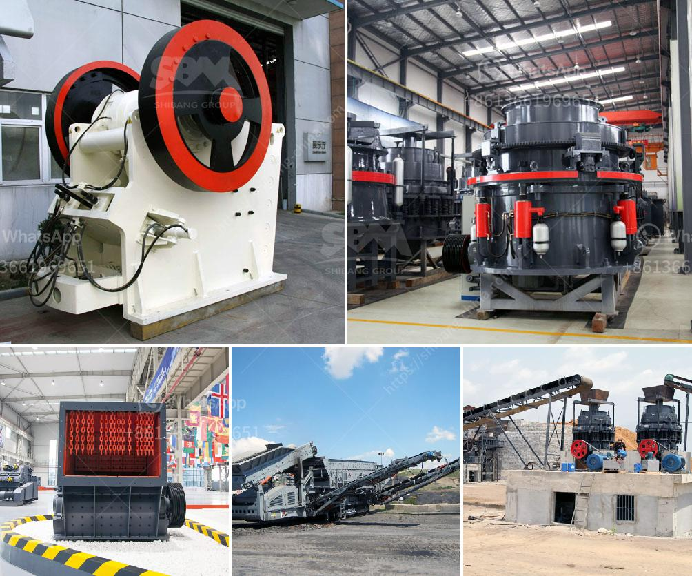

<h3>coal mining equipment manufacturers in south africa</h3>
South Africa is renowned for being a significant player in global coal production. Just one peek at the country's statistics reveals that coal mining remains a critical industry, contributing considerably to the country's economy. Coal production in South Africa is estimated to be about 260 million tons annually and makes up almost 90% of the country's energy supply requirements.

At the heart of South Africa's coal mining industry lies a vibrant and dynamic network of coal mining equipment manufacturers. These companies tend to be situated in the regions of the country that are in close proximity to the mining fields, thus providing excellent strong support for the mining operations through the supply of robust and highly reliable machinery. 

One such company that has been excelling in this sector is Osborn Engineered Products SA. With over a century of experience, Osborn is a leading global manufacturer of crushing and screening equipment for the mining and quarrying industries. Their extensive range of equipment includes crushers, feeders, screens, and modular plants. Osborn is known for its constant innovation and commitment to product development, ensuring that their equipment meets the demanding needs of the coal mining industry.

Another prominent player in this sector is Joy Global Africa. Joy Global designs, manufactures, and services mining equipment for various aspects of underground and surface mining. The company's wide range of machinery includes hydraulic excavators, rope shovels, draglines, and drills. Joy Global Africa is renowned for its state-of-the-art technology, innovative solutions, and a deep understanding of the specific requirements of the coal mining industry.

Becker Mining Systems South Africa is also an important player in the coal mining equipment manufacturing sector. Based in South Africa, the company partners with various mining houses and regional offices across the globe to provide cost-effective solutions to their clients. Becker Mining Systems' leading products include support systems, electrical switchgear, and monitoring solutions for underground mines. The company also offers a range of underground transportation solutions including transport systems, monorails, and chairlifts.

Babcock International Africa's mining division has a wide range of mobile crushing and screening equipment for various applications in the mining industry, particularly in the coal sector. They provide comprehensive crushing and screening solutions, ensuring effective coal processing and minimal downtime.

These are just a few examples of the numerous coal mining equipment manufacturers stationed in South Africa. Talented individuals and companies have, over the years, developed tried and tested equipment to make coal mining more efficient, safer, and cleaner. These advancements have also allowed South Africa to gradually move away from outdated coal-fired power plants, demanding cleaner and more sustainable energy sources.

The continuous development and improvement of mining equipment manufacturers in South Africa, especially in the coal mining industry, has transformed the sector into a world leader in innovation, creating products that are improving mining methods and techniques. Many companies have doubled down on their efforts to meet the need for safer mining practices, while also catering to the growing demand for alternative energy sources.
<h3>Contact us</h3><ul><li><strong>Whatsapp:&nbsp;<a href="https://wa.me/8613661969651">+8613661969651</a></strong></li><li><a href="https://swt.shibang-china.com/?git&amp;zhl&amp;coal mining equipment manufacturers in south africa"><strong>Online Service(chat now)</strong></a></li></ul><h3>Related</h3><ul><li><a href='aggregate crushing cost analysis in india.md'>aggregate crushing cost analysis in india</a></li><li><a href='trackmounted mobile crusher.md'>track-mounted mobile crusher</a></li><li><a href='coal washing plant spirals pdf.md'>coal washing plant spirals pdf</a></li><li><a href='the weight of stone crusher.md'>the weight of stone crusher</a></li><li><a href='raymond mill for grinding gypsum.md'>raymond mill for grinding gypsum</a></li></ul>