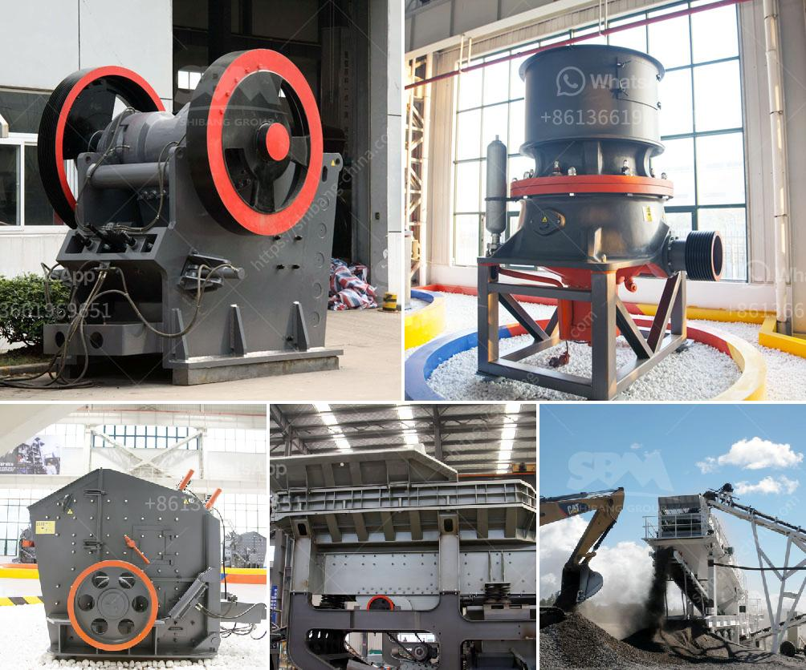

<h3>coal mining equipment south africa for sale</h3>
Coal mining in South Africa plays a significant role in the country's economy. Over 90% of the coal consumed in Africa is produced in South Africa. Coal mining equipment for sale is a crucial element in the success of mining operations in the country. When considering buying mining equipment, you have many options to choose from. Whether you need mining drills or underground haulage trucks, you can find it all with extensive choices available in the South African market.

One of the key coal mining equipment options for sale in South Africa is the Bell B60D Articulated Dump Truck. This machine is reliable, versatile, and efficiently performs coal mining operations in demanding conditions. It is a robust and durable equipment choice for any coal mine. The Bell B60D truck has a capacity of 30 tons, making it ideal for transporting large quantities of coal over rough terrain. Additionally, it features ADT-specific advantages such as high ground clearance and excellent off-road performance.

Another essential piece of coal mining equipment is the Komatsu 730E Mining Truck. This truck offers a powerful and efficient solution for coal haulage in open-pit mines. The Komatsu 730E has a payload capacity of 181 tons, enabling it to transport significant amounts of coal in a single trip. It is designed to provide comfort and safety for operators, with features such as shock-absorbing seats and excellent visibility from the cab.

When it comes to drilling equipment, the Atlas Copco DM30 II is a popular choice among coal mining operations in South Africa. This drilling rig is known for its versatility and efficiency in exploring and extracting coal reserves. The DM30 II can handle a variety of drilling applications, from surface mining to quarrying. It features advanced automation and control systems, allowing operators to maximize productivity and safety during drilling operations.

On the other hand, for underground coal mining, the Sandvik MH620 Roadheader is a reliable and efficient option. This machine specializes in cutting through mineral deposits to create underground passages. The MH620 Roadheader is equipped with advanced cutting tools and a powerful propulsion system. It can operate in challenging conditions, ensuring the smooth development of underground tunnels within coal mines.

Acquiring coal mining equipment in South Africa is a strategic decision that requires thorough research and careful consideration. With so many options available, it is essential to choose equipment that is suited to the specific needs and requirements of your mining operation. Factors such as reliability, efficiency, and safety should be prioritized when selecting the equipment.

Overall, the coal mining industry in South Africa presents numerous opportunities for investment and growth. To maximize the potential returns from coal mining operations, acquiring high-quality equipment is essential. With the wide range of options available in the market, there is a suitable equipment solution for every coal mining operation in South Africa.
<h3>Contact us</h3><ul><li><strong>Whatsapp:&nbsp;<a href="https://wa.me/8613661969651">+8613661969651</a></strong></li><li><a href="https://swt.shibang-china.com/?git&amp;zhl&amp;coal mining equipment south africa for sale"><strong>Online Service(chat now)</strong></a></li></ul><h3>Related</h3><ul><li><a href='jual stone crusher portable.md'>jual stone crusher portable</a></li><li><a href='sand and gravel suppliers located in cebu.md'>sand and gravel suppliers located in cebu</a></li><li><a href='sand making machine suppliers in coimbatore.md'>sand making machine suppliers in coimbatore</a></li><li><a href='raymond mill for sale second hand.md'>raymond mill for sale second hand</a></li><li><a href='stone crusher machine price for plant.md'>stone crusher machine price for plant</a></li></ul>