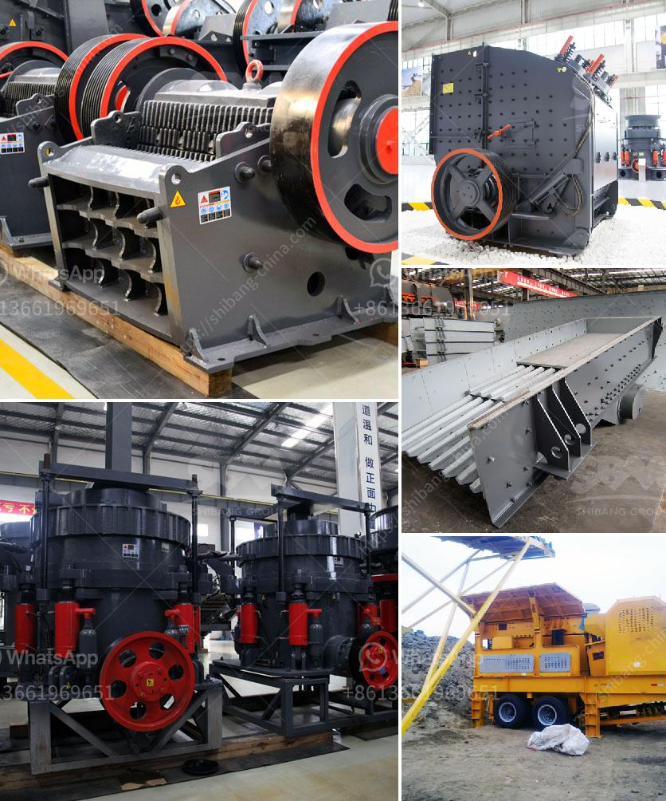

<h3>coal mining processes and machinary required</h3>
Coal mining is the process of extracting coal from the ground. It has been an important fuel source throughout history, and still plays a crucial role in powering industries worldwide. However, coal mining is not a simple task and requires an array of machinery and processes to extract coal efficiently.

One of the primary methods used to extract coal is underground mining. This process involves tunneling into the earth and creating shafts to access the coal seams. Underground mining machinery includes drilling equipment, roof bolters, shuttle cars, and scoops. Drilling equipment is used to create holes in the coal seam, while roof bolters secure the ceiling to prevent cave-ins. Shuttle cars transport coal from the mining face to the conveyor belt, and scoops load the coal onto the cars.

Open-pit mining is another commonly used method for coal extraction. It is used when the coal seams are close to the surface and can be accessed by removing overlying layers of rock and soil. Bulldozers and excavators are used to remove the layers of earth, exposing the coal seams. Haul trucks transport the coal from the pit to the processing plant or storage area.

In both underground and open-pit mining, coal processing plays a vital role. After extraction, the coal goes through various stages to remove impurities and prepare it for use. Coal processing machinery includes crushers, screens, coal washers, and magnetic separators. Crushers break the coal into smaller particles, while screens separate different-sized coal particles. Coal washers remove impurities from the coal, such as rocks and minerals, and magnetic separators separate coal from ferrous materials.

The machinery used in coal mining is designed to be robust and capable of handling the harsh working conditions of the industry. It is essential for the machinery to be reliable and efficient to ensure a continuous supply of coal. Regular maintenance and inspections are carried out to keep the machinery in good working order and to prevent breakdowns that can halt production.

In conclusion, coal mining processes involve a range of machinery and equipment to extract and process coal efficiently. Whether it is underground mining or open-pit mining, various machines are required to extract coal from the ground and prepare it for use. Coal mining machinery plays a pivotal role in meeting the energy demands of industries worldwide and ensuring a reliable supply of this essential fuel source.
<h3>Contact us</h3><ul><li><strong>Whatsapp:&nbsp;<a href="https://wa.me/8613661969651">+8613661969651</a></strong></li><li><a href="https://swt.shibang-china.com/?git&amp;zhl&amp;coal mining processes and machinary required"><strong>Online Service(chat now)</strong></a></li></ul><h3>Related</h3><ul><li><a href='feldspar stone for sale india.md'>feldspar stone for sale india</a></li><li><a href='quartz ball mills hyderabad.md'>quartz ball mills hyderabad</a></li><li><a href='machinery required to extract the platinum.md'>machinery required to extract the platinum</a></li><li><a href='the gold mining process in zimbabwe.md'>the gold mining process in zimbabwe</a></li><li><a href='top 10 stone crusher companies in india.md'>top 10 stone crusher companies in india</a></li></ul>